#Java SE基础语法

##异常

异常的5个关键字：`try``catch``finally``throw``throws`  

###概念
Java异常是Java提供的一种处理程序中错误的一种机制。错误是指程序**运行**过程中发生
的一些异常事件(如：除0溢出，数组下标越界，读取的文件不存在等)。Java程序执行过程
中如出现异常事件，可以生成一个异常对象，该异常对象封装了异常事件的信息并将提交给
Java运行时系统，这个过程成为抛出(throw)异常。当Java运行时系统接收异常时，回寻找能处理这一异常的代码并把异常对象交给其处理，这一过程成为捕获(catch)异常。 

###异常分类
**Error：**称为错误，由Java虚拟机生成并抛出，包括动态连接失败，虚拟机错误等，程序对其不作处理。**导致运行中断。**  
**Exception：**所有异常类的父类，其子类包含了所有可能出现的异常事件，一般需要用户显式声明或捕获。**用户可以处理。除Runtime异常外，其他的异常必须进行处理。**  
**Runtime Exception：**这是一类特殊的异常，如被0除，数组下标超出范围。这类异常产生比较频繁，处理麻烦，如果显式的声明或捕获将会对程序的可读性和运行效率造成较大的影响。因此由系统自动检测并将它们交给缺省的异常处理程序。**用户可以选择是否对其处理。**  
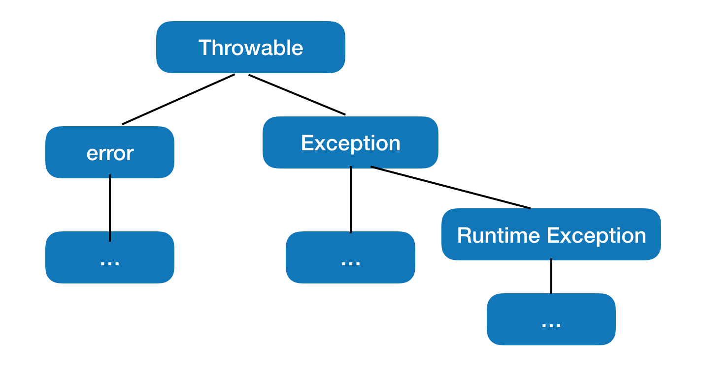  

###异常的捕获和处理
`try`语句块中执行可能会出现异常的语句，当出现异常时，`catch`语句块会捕获到相应的异常，并执行`catch`中的异常处理语句。`finally`语句块为异常处理提供一个统一的出口，无论`try`指定的程序块中是否抛出异常，`finally`指定的代码都会执行。通常在`finally`中进行资源清除工作。

	try {
		...
	} catch (Exception e) {
		...
	} finally {
		...
	}

###自定义异常
除了Java提供的异常外，也可以自定义异常。使用自定义异常一般有如下步骤：  
1. 通过继承java.lang.Exception类声明自己的异常。  
2. 在方法的适当地方生成自定义异常类的实例，并用`throw`语句抛出。  
3. 在方法的声明部分用`throws`语句声明该方法可能抛出异常。  

	/* 自定义异常类 */
	class MyException extends Exception {
		...
	}  
	
	/* 在方法中生成异常类的实例，并且抛出；方法声明部分也要用throws抛出*/
	public void m() throws MyException {
		...
		throw new MyExpection();
		...
	}

**注意：**重写方法需要抛出与原方法所抛出类型一致的异常，或不抛出异常。 
  
##数组

###概述
在Java中数组属于引用类型，可以把数组看作对象，二维数组可以看做是以数组为元素的数组。从内存中看，数组都存储在堆(heap)里，栈(stack)上永远只存储数组的引用。若数组的元素为基本类型变量，那么数组中存储的是变量的值；若数组的元素仍为引用类型的变量，那么数组中存储的是对象的引用。在Java中只有`int` `long` `short` `byte` `double` `float` `char` `boolean`属于基本类型变量。任何类型的数组都属于引用类型变量。

###数组初始化

####1.动态初始化
数组定义，数组分配空间和数组赋值分开进行。**定义时不能指定数组的长度。**
	
	int[] a;		
	int b[5];		//非法
	a = new int[2];
	a[0] = 0; 
	a[1] = 1; 
	
	Date[] d;
	d = new Date[2];
	d[0] = new Date(1, 1, 2000);
	d[1] = new Date(3, 5, 2018);

####2.静态初始化
在数组定义的同时就为数组分配空间并且赋值。**一旦完成初始化，数组的长度不能再更改。**

	int[] a = {0, 1, 2};

####3.默认初始化
数组是引用类型变量，因此数组中的元素属于成员变量，所以数组分配空间后，每个元素按照成员变量的规则被默认初始化。`boolean`初始值为`false`，其他均为`0`。

####4.二维数组初始化
多维数组的声明和初始化都应按照从高位到低维的顺序。

	//动态初始化
	int[][] a = new int[3][5];
	int[][] b = new int[2][];	//二维数组的低维可以单独分配空间，长度可以不一致
	b[0] = new int[10];
	b[1] = new int[20];
	//静态初始化
	int[][] c = {{0, 1}, {0, 1, 2}, {3, 4}};
	int d[3][2] = {{0, 1}, {2, 3}, {4, 5}};  //非法 	
###数组拷贝
使用java.lang.System中的静态方法
	
	public static void arraycopy(Ojeect src, int srcPos, Object dest, int destPos, length)
	
将src数组从srcPos开始的length个元素复制到dest数组中开始的length个位置。如果源数据数目大于目标数组长度，则会抛出`IndexOutOfBoundsException`异常。  
  
##常用类

包括字符串相关类(String、StringBuffer)、基本数据类型包装类、Math类、File类、枚举(enum)类。想要具体了解每个类内部的实现和使用，**请参阅Java API文档**。  

###字符串相关类String、StringBuffer  

###String类
java.lang.String代表**不可变**的字符序列。字符串的值一旦分配确定将不能再改变，如果要修改String的值，等于重新分配一块空间，在里面写上新的值。  
####1.String类的常见构造方法  
1.创建一个String类的拷贝 
	
	String(String original)  

2.用一个字符数组创建一个String对象
	
	String(char[] value)  

3.用一个字符数组从offset项开始的count个字符序列创建一个String对象

	String(char[] value, int offset, int count)  
	
####2.String类的常用方法
1.返回字符串的长度

	public int length()  
	
2.返回字符串中的第index个字符

	public char charAt(int index)   
	
3.返回字符串中出现str的第一个位置

	public int indexOf(String str)   
	
4.返回字符串中从fromIndex开始出现的str的第一个位置

	public int indexOf(String str, int fromIndex)  
	
5.比较字符串与another是否一样，忽略大小写  

	public boolean equalsIgnoreCase(String another)  
	
6.在字符串中用newChar字符代替oldChar字符  

	public String replace(char oldChar, char newChar)
	
7.判断字符串是否以prefix开头  

	public boolean startsWith(String prefix)  
	
8.返回一个字符串为该字符串的大写形式  

	public String toUpperCase()
	
9.返回该字符串从beginIndex开始到结尾的字符串  

	public String substring(int beginIndex)  
	
10.返回该字符串从beginIndex开始，到endIndex结束的字符串  

	public String substring(int beginIndex, int endIndex)  
	
11.返回该字符串去掉头尾两端空格后的字符串  
	
	public String trim()
	
12.返回一个字符数组，该字符数组存储的是将字符串转化为字符数组的结果  

	public char[] toCharAray()
	
13.String类的一个静态重载方法，可以将基础类型数据转化为字符串

	public String valueOf(int i) 	//valueOf(double d)...

14.将一个字符串按照指定的方法分割，返回分割后的字符串数组  

	public String[] spilt(String regex)

###StringBuffer类
java.lang.StringBuffer表示一个**可变**的字符序列。StringBuffer和String类似，但StringBuffer可对字符串的值修改。如果需要频繁修改字符串的值，请使用StringBuffer类以提高效率。

####1.StringBuffer类的常见构造方法
1.创建一个不包含字符序列的“空”的StringBuffer对象  
		
		StringBuffer()
		
2.创建一个StringBuffer对象，包含与String对象str相同的序列

	StringBuffer(String str)
	
####2.StringBuffer类的常用方法
1.StringBuffer包含一些和String类似的方法

	public int length()					//返回字符串长度
	public int indexOf(String str)		//返回第一次出现str的位置
	public int indexOf(String str, int fromIndex)		//返回字符串从fromIndex开始第一次出现str的位置
	public String substring(int start)					//返回字符串从start位置开始到末尾的子串
	public String substring(int start, int end)			//返回字符串从start位置开始，到end位置结束的子串
	...
	
2.在StringBuffer对象后面添加字符序列，返回添加后的StringBuffer的引用。方法经过重载，可以将多种类型数据转化后添加在StringBuffer对象后面。

	public StringBuffer append(String str)
	public StringBuffer append(StringBuffrer sbuf)
	public StringBuffer append(char[] str)
	public StringBuffer append(char[] str, int offset, int len)
	public StringBuffer append(double d)
	public StringBuffer append(Object obj)		//调用Object的toString()方法
	...
	
3.在StringBuffer对象指定的位置插入字符序列，返回修改后的该StringBuffer对象的引用。该方法也经过重载，可以将多种类型的值转换类型后插入。
	
	public StringBuffer insert(int offset, String str)
	public StringBuffer insert(int offset, double d)
	...
	
4.删除从start开始，到end-1为止的一段字符序列，返回修改后的StringBuffer对象的引用

	public StringBuffer delete(int start, int end)
	

5.将StringBuffer对象的字符序列逆序，然后返回该StringBuffer对象的引用

	public StringBuffer reverse()
	
  
###基本数据类型包装类
基本数据包装类包括`Integer` `Byte` `Long` `Short` `Double` `Float` `Boolean` `Character`共4类8种。这些类封装了一个相应的基本数据类型数值，并为其提供一系列操作。  
以`Integer`为例，类比其他类的构造方法和常用方法。

####1.Integer类的构造方法
1.将输入的int型数封装成一个Integer对象

	Integer(int value)
	
2.将输入的字符串解析成一个int型的数并封装成Integer对象

	Integer(String s)
	
####2.Integer类的常用方法
1.Integer中的静态常量
	
	public static final int MAX_VALUE	//最大int型数2^31-1
	public static final int MIN_VALUE	//最小的int型数-2^31
	
2.将字符串s解析成一个int型的数并返回。如果s不能解析成字符串，该方法会抛出一个NumberFormatException异常，否则不会抛。这种异常可以不捕获

	public static int parseInt(String s) throws NumberFormatException
	
3.将输入的值转化为Integer对象并返回，该方法有重载。该方法会抛出一个NumberFormatException异常，这种异常可以不捕获

	public static Integer valueOf(int i)
	public static Integer valueOf(String s) throws NumberFormatException
	
4.返回封装数据的long型值

	public long longValue()
	
5.返回封装数据的double型值

	public double doubleValue()
	
6.返回封装数据的int型值

	public int intValue()
	

###Math类
java.lang.Math类提供了一系列静态方法用于科学计算，其方法的参数和返回值类型一般为double型。

	public static XXX abs(XXX a)		//绝对值，XXX代表方法有重载
	public static XXX sqrt(XXX a)		//平方根
	public static double sin(double a)	//sin()函数，包含各种三角函数
	public static double pow(double a, double b)	//指数函数，返回a^b
	public static double random()		//返回0.0到1.0(不包括1.0)之间的一个随机数
	...
	
###File类
java.io.File类代表系统**文件名**，包括路径和文件名。File代表的是系统的文件名，并不表示具体的文件。

####File的常见构造方法
1.以pathname为路径创建File对象。如果pathname是相对路径，则默认的在当前路径在系统属性user.dir中存储

	public File(String pathname)
	
2.以parent为父路径，child为子路径创建File对象
	
	public File(String parent, String child)
	

####File类的常用方法
1.通过File对象可以访问文件的属性

	public File getParentPath()	//返回该路径的上一级路径，如果他没有上级路径，则返回null
	public String getPath()		//获取当前路径
	public String getName()		//获取当前文件名
	public long length()		//获取文件长度
	public long lastModified()		//返回文件上次修改时间
	public boolean isDirectory()	//当前File对象是否是路径
	public boolean isFile()			//当前File对象是否是文件
	public boolean canRead()
	public boolean canWrite()
	public boolean exists()
	public boolean isHidden()
	...
	
2.通过File对象创建空文件或者目录(在该对象所指的文件或目录不存在的情况下)

	public boolean createNewFile() throws IOException	//创建一个新的文件，该异常必须捕捉
	public boolean mkdir()
	public boolean mkdirs()		//创建在路径中一系列目录
	public boolean delect()		//删除当前文件
	public File[] listFiles()	//返回一个File[]数组，表示File路径下包含的文件或者路径。该方法有重载
	
###Enum类
java.lang.Enum类表示某一类型必须取某些特定的值之一。定义一种枚举就好像定义一种类型，一个类，然后再用这种类型去定义变量。枚举中的值好比类中的静态变量，枚举中的值只能是String类型。
  
为什么要使用枚举类型？  
答：如果程序中一定会出现一个错误，那么尽可能让它早点出现，最好在编译之前就把他写死，尽可能吧错误限定在更小的范围。如果出现这种情况，某一类型必须去某些特定的值之一，则可使用枚举类型。  
例如：

	public enum MyColor = {red, green, blue}
	MyColor mc = MyColor.red;
	
####1.Enum的常用方法
--内容待定--

##容器
容器是Java API所提供的一系列类的实例，用于在程序中存取对象。  

我的理解：容器是比数组更加灵活的一种数据结构。它不用指定大小(长度)，可以任意的往里面添加或者删除元素。

* 容器中只能存储“类”这种类型，而不能存储基本类型数据。基本数据类型存储在栈上，而类存储在堆中。
* 容器中可以存储各种类的实例，它们的类型不必相同。
* 比较两个对象是否相等，一般调用对象的equals()方法，在Map中调用hashCode()方法。调用hashCode()方法的效率更高。为了保持结果的一致性，如果重写了equals()方法，也应该重写hashCode()方法，使他们输出的结果一致。  
**备注**：HashSet中的add()方法，调用hashCode()方法判断集合中是否已存在该对象。

  
容器API的类图结构如下：  
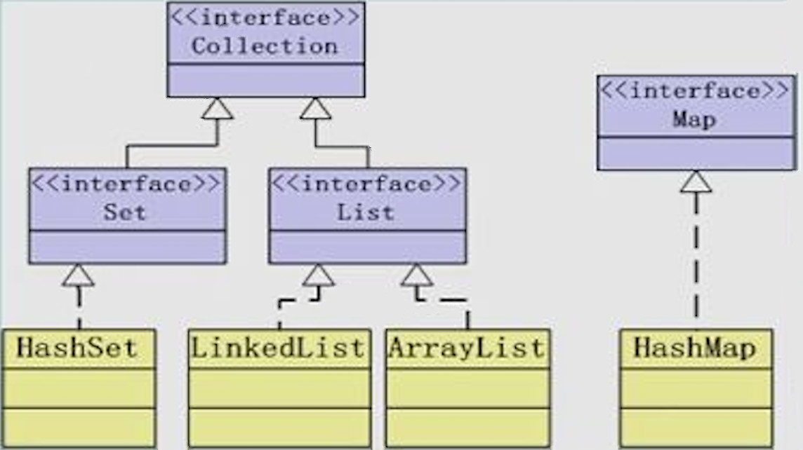

`Collection`接口定义了存取一组对象的方法，其子接口`Set`和`List`分别定义了存储方式。其中：  

* `Set`中的数据对象没有顺序且不可以重复  
* `List`中的数据对象有顺序且可以重复

`Map`接口定义了存储“键(key) — 值(value)映射对”的方法。

###Collection&lt;E&gt;接口  
Collection是最基本的集合接口，声明了适用于Java集合(只包括Set和List)的通用方法。Map接口并不是Collection接口的子接口，但它仍然可以看做是Collection框架的一部分。  
####Collection中定义的常用方法

	int size()			//返回容器中对象的数量
	boolean isEmpty()	//容器是否为空
	void clear()			//容器清空
	boolean contains(Object element)		//调用对象的equals()方法  
	boolean add(Object element)
	boolean remove(Object element)			//首先调用对象的equals()方法，找到相应对象
	Iterator<E> iterator()
	boolean containsAll(Colleaction c)	
	boolean addAll(Collection c)
	boolean removeAll(Collection c)
	boolean retainAll(Collection c)		//求容器和指定容器的交集
	Object[] toArray()					//将容器中的所有对象转化为一个Object型数组返回

###Iterator&lt;E&gt;接口
Iterator对象称为迭代器，用来实现对容器内元素的遍历操作。所有实现了Collection接口的容器类都有一个iterator()方法用以返回一个实现了Iterator接口的对象。
####Iterator接口定义的方法
1.判断容器中是否还有可供访问的元素

	boolean hasNext()
	
2.返回游标右边的元素并将游标移动到下一个位置。返回类型是Object，需要强制转化为自己需要的类型。

	E next()
	
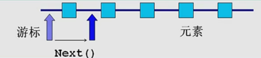
	
3.删除游标左边的元素，即游标刚刚越过的元素。在执行完next()之后该操作只能执行一次。  

	void remove()
	
使用Iterator对象遍历容器内元素时，Iterator对象给容器上了锁。如果想要删除容器中的元素，必须使用Iterator对象中的remove()方法，不能使用容器的remove()方法。  

###Set&lt;E&gt;接口
Set接口是Collection接口的子接口。Set接口没有提供额外的方法，但实现Set接口的容器类中的元素是没有顺序的，而且不可以重复。Java API中提供的容器有HashSet、LinkedHashSet和TreeSet。

###List&lt;E&gt;接口
List接口是Collection的子接口。实现List接口的容器类的元素是有顺序的，所以可以重复。List容器中的元素都对应一个整数型的序号记载在其容器中的位置，可以根据序号存取容器中的元素。Java API提供的List容器有ArrayList，LinkedList等。

####1.List接口定义的方法
List接口中除了Collection接口定义的方法外，还包括：  
	
	E get(index)
	E remove(int index)		
	E set(int index, E element)		//将index处的对象设置为element，返回原本index处的对象  
	void add(int index, E element)	//在index位置添加一个对象，后面的对象一次往后挪一个位置  
	int indexOf(Object o)			//需要调用对象的equals()方法。返回序列上第一次出现o的位置
	int lastIndexOf(Object o)		//与indexOf()相反，返回序列上最后一次出现o的位置

####2.List常用算法
类java.util.Collections提供了一些静态方法实现了基于List容器的一些常用算法。  

1.对List容器内的元素按照升序排序。要使用此方法排序对象，必须首先在类中实现Comparable接口。

	static <T extends Comparable<? super T>> sort(List<T> list)
	
2.将List中的对象随机排列
	
	static void shuffle(List<T> list)
	
3.对List中的对象逆序排列

	static void reverse(List<?> list)

4.用一个特定的对象重写整个容器

	static<T> void fill(List<? super T> list, T obj)
	
5.将src List容器中的元素拷贝到dest List容器中

	ststic<T> void copy(List<? super T> dest, List<? super T> src)
	
6.对于顺序的List的容器，使用折半查找的方法查找特定的对象

	static<T> int binarySearch(List<T entends Comparable<? super T>> list, T key)
	
	
###Comparable&lt;T&gt;接口
所有可以排序的“类”都实现了java.lang.Comparable接口。实现了Comparable接口中的compareTo()方法从而确定该类对象的排序方法。
####Comparable接口中的方法
Comparable接口中只有一个方法
	
	public int compareTo(T o)
	
compareTo(T o)方法的返回值：  

* 返回 0 表示 this == o  
* 返回正数表示 this > o  
* 返回负数表示 this < o

###Map&lt;K, V&gt;接口
Map是一个双列集合接口。Map接口使用“键(key)—值(value)”对存储数据，Map中的数据通过键值对标识，所以键不能重复。Map接口实现的类有HashMap和TreeMap。
####Map接口中的常用方法
1.向map中存储一个键值对。如果Map中已存在该key，则将该key对应的value修改为新的value，并返回原来的value。
	
	V put(K key, V value)	
	
2.其他方法

	int size()
	void clear()
	void putAll(Map map)
	V get(Object key)		//返回该key对应的value  
	V remove(Object key)
	boolean isEmpty()
	boolean containsKey(Object key)
	boolean containsValue(Object value)

###三个知识点
####1.增强的for循环(EnhancedFor)
增强的for循环和iterator遍历效果是一样的，增强的for循环内部是调用Iterator实现的。但是，增强的for循环有些缺点，例如不能再增强循环里面动态的删除集合内容，不能获取下标等。一般不要求在自己的程序里面使用增强的for循环，能看懂别人写的增强for循环即可。  
ArrayList使用数组实现，下标明确，使用普通循环遍历效率更高。而对于LinkedList，如果要获取每一个元素，要从头开始找，因此建议使用增强的for循环，或者iterator。  

例子：

	int[] arr = {1, 2, 3, 4};

	//普通for循环
	for(int  i = 0; i < arr.length; i++) {
		System.out.print(arr[i] + " ");
	}
	
	//增强的for循环
	for(int i : arr) {
		System.out.print(i + " ");
	}
	
####2.自动打包/解包(Auto-boxing/unboxing)
自动打包就是将基础类型数据转换为对象。自动解包就是将对象转化为基础类型数据。  
我的理解：自动打包就是，假如在程序的某些地方需要输入一个对象，为了方便起见，可以直接输入一个基础类型数据，java会自动把这个数据封装为相应的对象再交还给程序。自动解包就是，可以直接把一个对象赋值给基础型变量，当然这个对象必须属于8个基础数据对应的8个对象之一。  

例子：

	//自动打包
	//调用Map的put方法需要输入两个对象，但是可以使用1代替new Integer(1)。
	//下面两句实现的功能一样
	put("one", new Integer(1));
	put("one", 1);
	
	//自动解包
	//将fre对象的值赋值给int型变量时，一般需要调用Integer的intValue方法，但是也可以直接赋值。
	//下面两句实现的功能一样
	Integer fre = new Integer(1);
	int a = fre.intValue();
	int b = fre;

####3.泛型(Generic)
泛型即“参数化类型”，就是把类型由原来具体的类型参数化，类似于方法中的变量，此时类型也定义为参数形式，在调用时在传入具体类型。泛型只在编译阶段有效。泛型在使用过程中，操作的数据类型被指定为一个参数，这种参数类型可以用在类，接口和方法中，分别称为泛型类，泛型接口和泛型方法。  
从集合中取出内容时往往需要转型，效率低并且容易出现错误。如果在定义集合的时候使用泛型，同时定义集合中对象的类型，就不用再强制转换。增强了程序的可读性和稳定性。  

[Java泛型详解-ImportNew](http://www.importnew.com/24029.html)

##IO流
在Java程序中，对于数据的输入/输出操作以“流”(stream)方式进行。Java SE提供了各种各样的“流”类，用以获取不同种类的数据；程序中通过标准的方法输入或输出数据。  

###输入/输出流分类
java.io包中定义了多个流类型(类或抽象类)来实现输入/输出功能：可以从不同的角度对其分类：  

* 按数据流的方向不同可以分为输入流和输出流。  
* 按照处理数据单位的不同可以分为字节流和字符流。  
* 按照功能不同可以分为节点流和处理流。  

Java SE所提供的所有流类型位于java.io内部分别继承自以下四种抽象流类型：

|            |     字节流        |    字符流   |
| :--------: | :--------------: | :--------: |
| **输入流**  |   InputStream    |   Reader   |
| **输出流**  |   OutputStream   |   Writer   |

节点流和处理流：  
节点流为可以从一个特定的数据源(节点)读写数据(如：文件，内存等)。  

处理流是“连接”在已存在的流(节点流或处理流)之上，通过对数据的处理为程序提供更为强大的读写功能。  

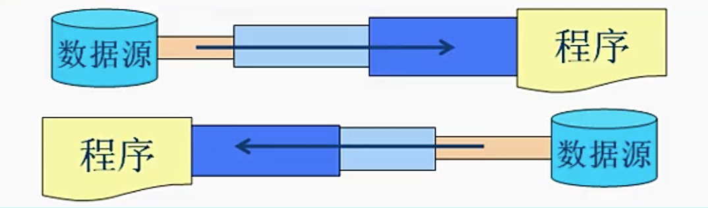
 
我的理解：节点流是真正把数据源和程序连接起来的工具，但是由于节点流的读取性能较差，因此在节点流上在包装一层处理流，当然处理流上也可以再包装处理流。处理流的读取性能较好，也使开发人员更方便的使用。  

###InputStream
继承自java.io.InputStream的流都是用于向程序中输入数据，且数据的单位为字节(8 bit)。下图为继承自InputStream的所有类，深色为节点流，浅色为处理流。

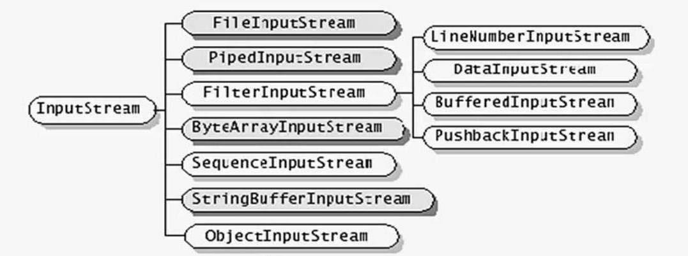

####InputStream的基本方法
1.读取一个字节并以整数的形式返回(0~255)，如果返回-1表示已到输入流的末尾。

	int read() throws IOException
	
2.读取一系列字节并存储到一个数组buffer，返回实际读取的字节数，如果读取前已到输入流的末尾返回-1。

	int read(byte[] buffer) throws IOException
	
3.读取length个字节，并存储到一个字节数组buffer，从offset位置开始，返回实际读取的字节数，如果读取前已到输入流的末尾返回-1。

	int read(byte[] buffer, int offset, int length) throws IOException
	
4.跳过n个字节不读，返回实际跳过的字节数。并不常用。

	long skip(long n) throws IOException
	
5.关闭流释放内存资源。

	void close() throws IOException
	
	
###OutputStream
继承自java.io.OutputStream的流是用于程序中输入数据，且数据的单位为字节(8 bit)。下图为继承自OutputStream的所有类，深色为节点流，浅色为处理流。

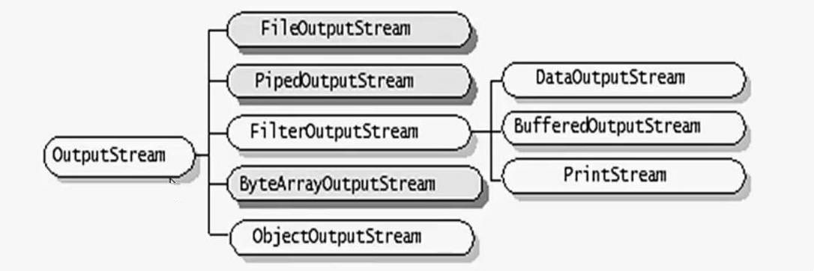

####OutputStream的基本方法
1.向输出流中写入一个字节数据，该字节数据为参数b的低8位。

	void write(int b) throws IOException
	
2.将一个字节类型的数组中的数据写入输出流。

	void write(byte[] b) throws IOException
	
3.将一个字节类型的数组中的从指定位置(off)开始的len个字节写入到输出流。

	void write(byte[] b, int off, int len) throws IOException
	
4.将输出流中缓冲的数据全部写出到目的地。

	void flush() throws IOException
	
5.关闭流释放内存资源。

	void close() throws IOException
	
###Reader
继承自java.io.Reader的流都是用于向程序中输入数据，且数据的单位为字符(2字节，16bit)。下图为继承自Reader的所有类，深色为节点流，浅色为处理流。

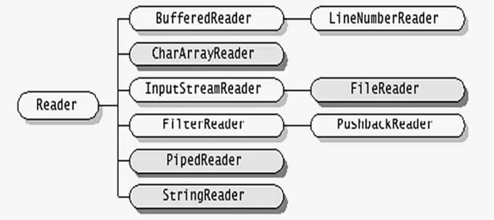

####Reader的基本方法
1.读取一个字符并以整数的形式返回(0~65535)，如果返回-1表示已到输入流的末尾。

	int read() throws IOException
	
2.读取一系列字符并存储到一个数组buffer，返回实际读取的字符数，如果读取前已到输入流的末尾返回-1。

	int read(byte[] cbuf) throws IOException
	
3.读取length个字符，并存储到一个数组buffer，从offset位置开始，返回实际读取的字符数，如果读取前已到输入流的末尾返回-1。

	int read(char[] cbuf, int offset, int length) throws IOException
	
4.跳过n个字节不读，返回实际跳过的字节数。

	long skip(long n) throws IOException
	
5.关闭流释放内存资源。

	void close() throws IOException
	
###Writer
继承自java.io.Writer的流都是用于程序中输入数据，且数据的单位为字符(2字节，16bit)。下图为继承自Writer的所有类，深色为节点流，浅色为处理流。

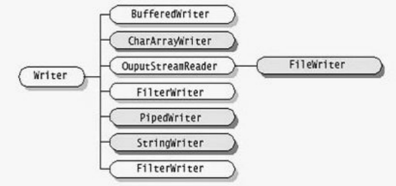

####Writer的基本方法
1.向输出流中写入一个字符数据，该字节数据为参数b的低16位。

	void write(int c) throws IOException
	
2.将一个字符类型的数组中的数据写入数据流。

	void write(char[] cbuf) throws IOException
	
3.将一个字符类型的数组中从指定位置(offset)开始的length个字符写入到输出流。

	void write(char[] cbuf, int offset, int length) throwsIOException
	
4.将一个字符串中的字符写入到输出流。  该方法调用了String类的toCharArray()方法先把字符串转化为字符数组，然后在讲一个个字符写入输出流。  

	void write(String string) throws IOException
	
5.将一个字符串从特定位置(offset)开始的length个字符写入到输出流。

	void write(String string, int offset, int length) throws IOException

6.将输出流中缓冲的数据全部写出到目的地。

	void flush() throws IOException
	
7.关闭流释放内存资源。

	void close() throws IOException
	
###节点流类型

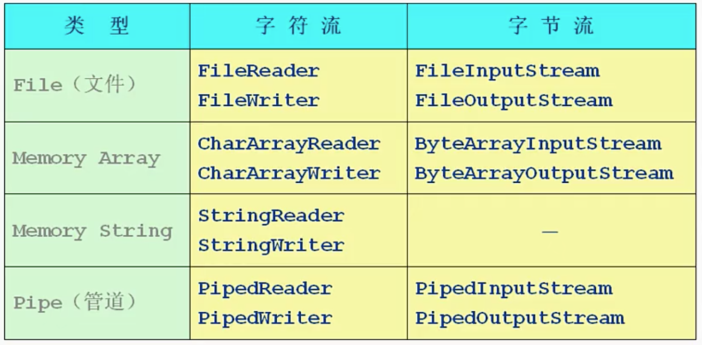

`FileInputStream``FileOutputStream``FileReader``FileWriter`分别继承于上面四个抽象类，实现了这四个抽象类中的所有方法，用于一般的文件输入输出。`Pipe`类型常用于线程中。

###FileInputStream和OutputStream
`FileInputStream`和`FileOutputStream`分别继承于`InputStream`和`OutputStream`，支持其父类所提供的数据读写方法。用于向文件中输入和输出字节。  
注意：在实例化`FileInputStream`和`FileOutputStream`流时要用`try`-`catch`语句以处理其可能抛出的`FileNotFoundException`异常。在读写数据时也要用`try`-`catch`语句以处理可能抛出的`IOException`异常。其中`FileNotFoundException`是`IOException`异常的子类。  

####FileInputStream和FileOutputStream常用的构造方法

	FileInputStream(String name) throws FileNotFoundException
	FileInputStream(File file) throws FileNotFoundException
	FileOutputStream(String name) throws FileNotFoundException
	FileOutputStream(File file) throws FileNotFoundException
	FileOutputStream(File file, boolean append) throws FileNotFoundException	//append为true，表示在源文件内容后继续添加；否则表示重写源文件

	
###FileReader和FileWriter
`FileReader``FileWriter`和`FileInputStream``FileOutputStream`类似。`FileReader`和``FileWriter`分别继承于`InputStreamReader`和`OutputStreamWriter`，支持其父类所提供的数据读写方法。用于向文件中输入和输出字节。  
注意：在实例化`FileReader`和`FileWriter`流时要用`try`-`catch`语句以处理其可能抛出的`FileNotFoundException`异常。在读写数据时也要用`try`-`catch`语句以处理可能抛出的`IOException`异常。其中`FileNotFoundException`是`IOException`异常的子类。  

####FileReader和FileWriter的常用构造方法

	FileReader(String name) throws FileNotFoundException
	FileReader(File file) throws FileNotFoundException
	FileWriter(String name) throws FileNotFoundException
	FileWriter(File file) throws FileNotFoundException
	FileWriter(File file, boolean append) throws FileNotFoundException	//append为true，表示在源文件内容后继续添加；否则表示重写源文件
	

###处理流类型

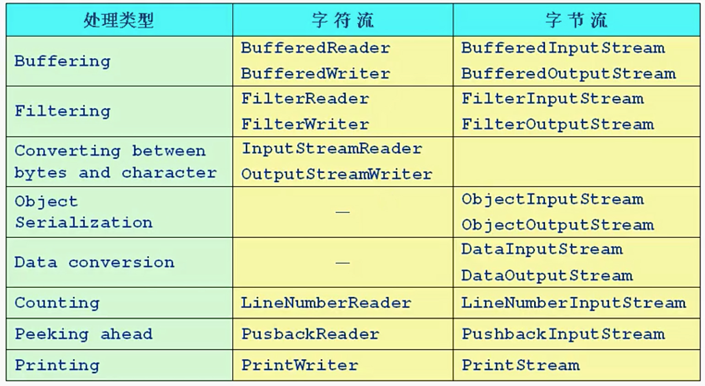

处理流包括缓冲流、转换流、对象序列流、计数流和输出流等。  

###缓冲流
缓冲流要“套接”在相应的节点流上，对读写的数据提供缓冲的作用，提高了读写的效率，同时增加了一些新方法，缓冲流属于**处理流**。Java SE一共提供了四种缓冲流，`BufferedInputStream``BufferedOutputStream``BufferedREader`和`BuffredWriter`。  

####1.缓冲流常用构造方法

	BuffeedReader(Reader in)
	BuffeedReader(Reader in, in sz)	//sz为自定义缓冲区大小
	BuffeedWriter(Writer out)
	BuffeedWriter(Writer out, int sz)
	BufferedInputStream(InputStream in)
	BufferesInputStream(InputStream in, int size)
	BufferedOutputStream(OutputStream out)
	BufferedOutputStream(OutputStream out, int size)
	
####2.缓冲流的常用方法
缓冲流除了继承自父类的一些常用读写和控制方法外，还有些新增加的方法。对于输出缓冲流，写出的数据会先在内存中缓存，使用flush()方法将输出的数据立刻写出，然后再关闭流。  

#####BufferedReader的常用方法
1.输入缓冲流支持父类的mark()方法。标记当前流的位置，调用reset()方法可回到此位置。参数readAheahLimit表示在标记点之后最大可以读取的字符数量，若超过此长度，mark自动失效。  

	void mark(int readAheadLimit) throws IOException
	
2.输入缓冲流支持父类的reset()方法。调用reset()方法可将读入点返回到mark标记的地方。  

	void reset() throws IOException			
3.读取一行文字，并以字符串的形式返回。如果遇到换行符('\n')或者回车符('\r')读取结束。

	String readLine() throws IOException
	
#####BufferedWriter的常用方法
1.写入一个行分隔符。行分隔符字符串由系统属性line.separator定义，并不一定只是一个换行符('\n')。

	void newLine() throws IOException
	
###转换流
转换流用于字节数据到字符数据之间的转换，包括`InputStreamReader`和`OutputStreamWriter`。`InputStream`需要和`InputStreamReader`套接。`OutputStream`需要和`OutputStreamWriter`套接。

####转换流常用的构造方法

	InputStreamReader(InputStream in)
	InputStreamReader(InputStream in, String charasetName)	//创建一个输入转换流，并使用指定的编码方式
	OutputStreamWriter(OutputStream out)
	OutputStreamWriter(OutputStream out, String charsetName)	//创建一个输出转换流，并指定特定的编码方式

###数据流
数据流`DataInputStream`和`DataOutputStream`分别继承自`InputStream`和`OutputStream`，它属于**处理流**，需要分别套接在`InputStream`和`OutputStream`类型的节点流上。`DataInputStream`和`DataOutputStream`提供了可以存取与机器无关的Java原始类型数据（如：int， double等）的方法。  

####数据流的常用构造方法

	DataInputStream(InputStream in)
	DataOutputStream(OutputStream out)
	
####数据流的常用方法
#####DataInputStream的常用方法
1.包含从父类继承的常用方法。
	
	read(byte[] b)
	read(byte[] b, int off, int len)
	
2.`DataInputStream`特有的输入方法，可以直接读取各种Java原始类型数据。

	boolean readBoolean()	
	byte readByte()
	char readChar()
	double readDouble()
	float readFloat()
	int readInt()
	String readUTF()	//以UTF-8的格式读入一个字符串
	...
	
#####DataOutputStream的常用方法
1.包含从父类继承的常用方法。

	void write(int b)
	void write(byte[] b, int off, int len)
	void flush()
	int size()
	
2.`DataOutputStream`特有的方法，可以直接写入各种Java原始类型的数据。

	void writeBoolean(boolean v)
	void writeByte(int v)
	void writeBytes(String s)
	void writeChar(char c)
	void writeChars(String s)
	void writeInt(int v)
	void writeLong(long v)
	void writeUTF(String str)	//以UTF-8的格式输出字符串
	...

###字节数组流
`ByteArrayInputStream`和`ByteArrayOutputStream`分别继承自`InputStream`和`OutputStream`，它属于**节点流**。字节数组输出流`ByteArrayOutputStream`直接在内存上分配一块自己数组，用于输出数据。字节数组输入流`ByteArrayInputStream`包含一个在内存上的字节数组，读取时是直接从此字节数组中读取数据。

####字节数组流的常用构造方法

	ByteArrayInputStream(byte[] buf)	//在内存上创建一个用于读入的内存数组
	ByteArrayOutputStream()				//字节数组输出流是在内存上开辟一块字节数组然后写进去的，因此不要指定路径
	ByteArrayOutputStream(int size)		//可以指定字节数组的大小
	
####字节数组流的常用方法
#####ByteArrayInputStream的常用方法
1.包含从父类继承的方法。

	int read()
	int read(byte[] b, int off, int len)
	void mark()
	void reset()
	long skip(long n)

2.返回可从此流中读取的剩余字节数。
	
	int available()

#####ByteArrayOutputStream的常用方法
1.包含从父类继承的方法

	void write(int b)
	void write(byte[] b, int off, int len)
	void close()
	
2.创建一个新分配的字节数组，其大小是此输出流的当前大小，并且缓冲区的有效内容已被复制到其中。  

	byte[] toByteArray()
	
3.使用平台的默认字符集将缓冲区的内容转换为字符串。新字符串的长度是字符集的函数，因此可能不等于缓冲区的大小。此方法始终使用平台默认字符集的默认替换字符串替换格式错误的输入和不可映射字符序列。当需要对解码过程进行更多控制时，应该使用CharsetDecoder类。  

	String toString()
	
4.将此字节数组输出流的完整内容写入指定的输出流，就像使用out.write(buf, 0, count)调用输出流的写入方法一样。

	void writeTo(OutputStream out)
	
###Print流
`PrintWriter`和`PrintOutputStream`分别继承自`java.io.Writer`和`java.io.FilterStream`，它们都属于输出流，分别针对字符和字节。`PrintWriter`和`PrintOutputStream`提供了重载的print()和println()方法用于多种数据类型的输出，并且它们的输出操作都不会抛出异常，并且带有自动的flush功能。  

####Print流的常用构造方法

	PrintWriter(Writer out)
	PrintWriter(Writer out, boolean autoFlush)
	PrintWriter(OutputStream out)
	PrintWriter(OutputStream, boolean autoFlush)
	PrintStream(OutputStream out)
	PrintStream(OutputStream out, boolean autoFlush)
	
####Print流的常用方法
PrintWriter和PrintStream具有相同的方法。

	PrintWriter/PrintStream append(char c)				//将指定的字符附加到输出流上
	PrintWriter/PrintStream append(Charsequence csq)	//将指定的字符序列附加到输出流上
	boolean checkError()			//flush当前流，并检查基础流是否抛出异常
	void print/println(boolean b)
	void println()					//写入行分隔符终止当前行，line.sequarator
	void print/println(char c)		//println()与print()方法的区别就是打印完字符后，再调用一次println()方法
	void print/println(char[] s)
	void print/println(double d)
	void print/println(Object obj)
	void print/println(String s)
	void write(int b)
	void write(byte[] b, int off, int len)
	void flush()
	vois close()
	

###Object流
`ObjectInputStream`和`ObjectOutputStream`分别继承自`java.io.InputStream`和`java.io.OutputStream`。Object流的作用是直接将一个对象转化为字节流，其实就是序列化。对象可以被序列化，则它的类必须实现`serializable`接口或者`externalizable`接口。在序列化过程中若不想某个成员变量被序列化，在成员变量前面加上`transient`关键字即可。

####Object流的常用构造方法

	ObjectInputStream()
	ObjectInputStream(InputStream in)
	ObjectOutputStream()
	ObjectOutputStream(OutputStream out)
	
####Object流的常用方法
#####ObjectInputStream流的常用方法
1.继承自父类的常用方法。

	int available()
	int read()
	int read(byte[] buf, int off, int len)
	boolean read()	//读取各种类型的数据int,double,short,char
	void close()
	
2.读取一个对象并返回。

	Object read(Object obj)		//该方法返回值为Object类型，需要强制转化需要的类型
	
#####ObjectOutputStream流的常用方法
1.继承自父类的常用方法。
	
	void write(int val)
	void write(byte[] buf)
	void writeInt(int val)		//写入各种类型的数据
	void writeChar(char c)
	void writeChars(String s)
	void flush()
	void close()
	
2.将一个对象写入目的地。

	void writeObject(Object obj)
	
	
###Serializable接口
`Serializable`接口为标记性接口，继承此接口不用实现任何方法。若一个类实现此接口，则表示它可被序列化，序列化的方式由Java提供的默认方式进行。此接口常和Object流配合使用。  

###Externalizable接口
`Externalizable`接口继承自`Serializable`接口,同样是为了完成对象序列化。但是`Externalizable`接口可以自定义对象序列化的方式 ，一般不常用。此接口常和Object流配合使用。    

####Externalizable接口的使用方法
----待写----  

如果用到，请查阅API文档。  

###transient关键字
在对象的序列化过程中，不想某个成员变量被序列化，在其定义前加上`transient`关键字即可。拥有该属性的成员变量在序列化过程中，会将此成员变量的初始化默认值作为其值序列化。  

例如：

	class T implements Serializable{
		int v = 5;
		transient double d = 12.3；
	}
	
该类在序列化后读取其中成员变量的值可得：
	
	v = 5;
	d = 0.0;
	
###IO流总结

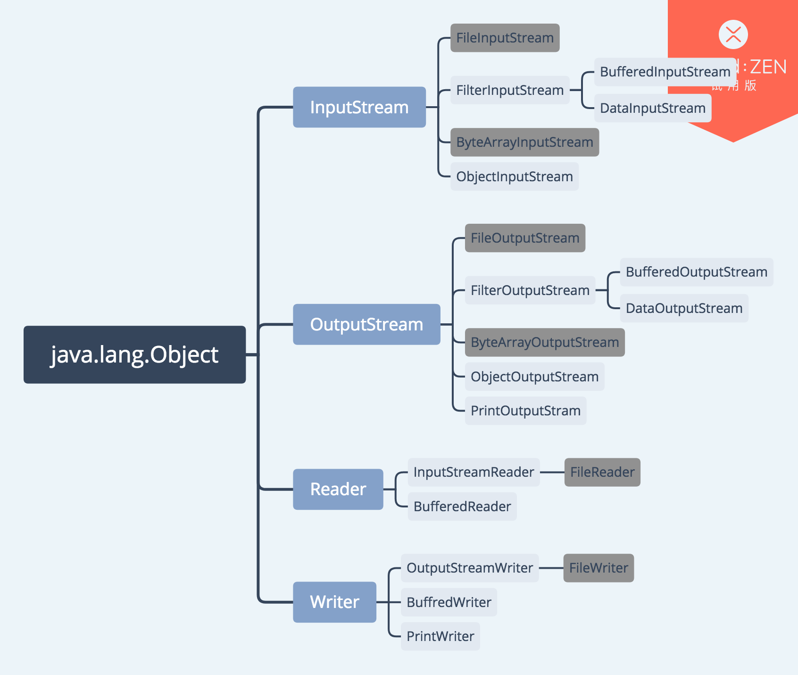

将本章讲过所有的有关IO类之间的继承关系画出来，以方便理解。  
其中深蓝色为`Object`类，浅蓝色为IO流的四个抽象类，IO流的所有类都继承自这四个抽象类。深灰色为节点流类型，浅灰色为处理流类型。  

列出本章出现过的所有的封装方法：  
1.四个抽象类的实现
	
	FileInputStream fis = new FileInputStream("路径");
	FileOutputStream fos = new FileOutputStream("路径");
	FileReade fr = new FileReader("路径");
	FileWriter fw = new FileWriter("路径");
	
2.缓冲流的封装

	BufferedInputstream bis = new BufferedInputStream(new FileInputStream("路径"));
	BufferedOutputStream bos = new BufferedOutputStream(new FileOutputStream("路径"));
	BufferedReader br = new BufferedReader(new FileReader("路径"));
	BufferedWriter bw = new BufferedWriter(new FileWriter("路径"));
	
	BuffererReader br2 = new BufferedReader(new InputStreamReader(...));
	BufferedWriter bw2 = new BufferedWriter(new OutputStreamWriter(...));
	
3.转换流的封装

	InputStreamReader isr = new InputStreamReader(System.in);
	OutputStreamWriter osw = new OutputStreamWriter(System.out);

	InputStreamReader isr2 = new InputStreamReader(new FileInputStream("路径"));
	OutputStreamWriter osw2 = new OutputStreamWriter(new FileOutputStream("路径"));
	
4.数据流的封装

	DataInputStream dis = new DataInputStream(new ByteArrayInputStream());
	DateOutputStream dos = new DataOutputStream(new ByteArrayOutputStream());
	
5.输出流的封装

	PrintStream ps = new PrintStream(System.out)
	PrintStream ps2 = new PrintStream(new FileOutputStream("路径"));
	//PrintStream ps3 = new PrintStream("路径");	//此方法会自动调用OutStreamWriter的构造方法
	
	//PrintWriter pw = new PrintWriter("路径");	//此方法会自动调用OutStreamWriter的构造方法
	PrintWriter pw2 = new PrintWriter(new FileWriter("路径"));
	
6.对象流的封装

	ObjectInputStream ois = new ObjectInputStream(new FileInputStream("路径"));
	ObjectOutputStream oos = new ObjectOutputStream(new FileOutputStream("路径"));
	
		
##线程
线程是一个程序内部的顺序控制流，Java的线程是通过java.lang.Thread类实现的，可以通过创建Thread的实例来创建新的线程。每个线程都是通过某个特定Thread对象所对应的run()方法来完成其操作的，run()方法称为线程体。通过调用Thread类的start()方法启动一个线程。java虚拟机启动时会有一个main()方法（public static void main(){}）的主线程。  

**线程和进程的区别：**  

进程：执行中程序。一个进程至少包含一个线程。  
线程：进程中负责程序执行的执行单元，线程本身依靠程序运行。线程是程序中的顺序控制流，只能使用分配给程序的资源和环境。  

- 每个进程都有独立的代码和数据空间（进程上下文），进程间的切换会有较大的开销。
- 线程可以看成是轻量级的进程，同一类线程共享代码和数据空间，每个线程有独立的运行栈和程序计数器（PC），线程切换开销小。
- 多进程：在操作系统中能同时运行多个任务（程序）。
- 多线程：在同一应用程序中有多个顺序流同时执行。

###线程的状态转化

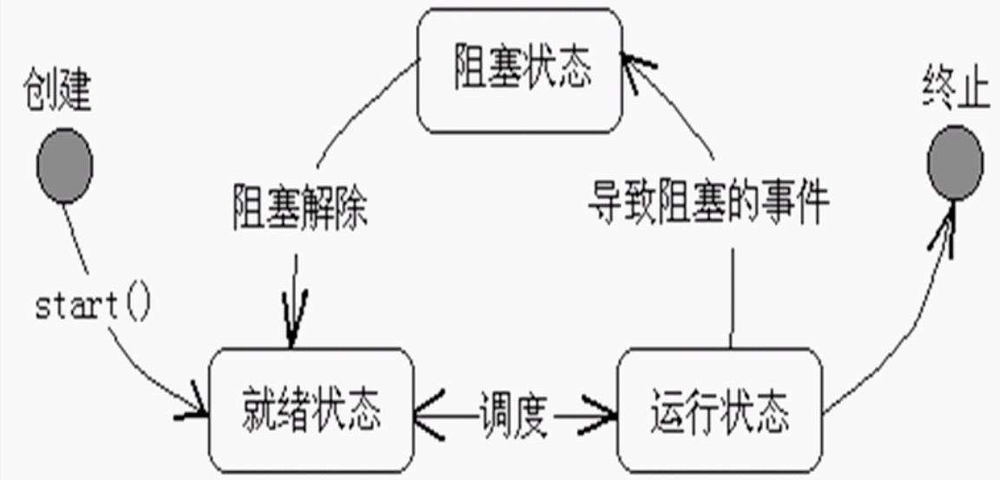

**创建状态：**使用new关键字和Thread类或者子类建立一个线程对象后，该线程对象就处于创建状态。他保持这个状态直到程序start()这个线程。  

**就绪状态：**当线程对象调用了start()方法后，该线程就进入就绪状态。就绪状态的线程处于就绪队列中，要等待JVM里线程调度器的调度。  

**运行状态：**如果就绪状态的线程获取到CPU资源，就可以执行run()方法，此时线程便处于运行状态。处于运行状态的线程最复杂，它可以变为阻塞状态、就绪状态和死亡状态。 
 
**阻塞状态：**如果一个线程执行了sleep()方法、suspend()等方法，失去所占用的资源之后，该线程就从运行状态进入阻塞状态。在睡眠时间已到或获得设备资源后可以重新进入就绪状态。可以分为三种：  

- 等待阻塞：运行中的线程执行wait()方法，使线程进入等待阻塞状态。
- 同步阻塞：线程在获取synchronized同步锁失败（因为同步锁被其他线程占用）时。
- 其他阻塞：通过调用线程的sleep()方法或join()方法发出请求I/O时，线程进入阻塞状态。当sleep()状态超时时，join()等待线程终止或者超时，或者处理I/O完毕，线程重新进入就绪状态。

**终止状态:**一个运行状态的线程完成任务或者其他终止条件发生时，该线程就切换到终止状态。

###线程的创建和启动
创建和启动线程可以通过以下两种方法进行，分别是通过实现`Runnbale`接口和继承`Thread`类：  

**实现Runnable接口**  
定义一个类实现`Runnable`接口，再使用`Thread`的带参构造器生成线程。`Runnable`接口非常简单，只包含一个run()方法。需要实现这个方法来告诉系统线程将如何运行。在实现`Runnable`接口的类的run()方法中也可以使用`Thread`的静态方法。
  

例子：
	
	Thread t = new Thread(new Runner()); 

	class Runner implements Runnable {
		public void run() {
			...
		}
	}

**继承Thread类**  
因为`Thread`类实现了`Runnable`接口，所以可以定义一个Thread类的扩展类，并且实现run()方法。但是，**不推荐这种设计**，因为它将任务和运行任务的机制混在了一起，将任务和从线程中分离出来是比较好的设计。

例子：

	MyThread mt = new MyThread();

	class MyThread extends Thread {
		public void run() {
			...
		}
	}
	
	
####Runnable接口
java.lang.Runnable接口只是一个普通接口，里面只包含一个run()方法，只实现`Runnable`接口不能生成一个线程。若要生成线程，仍然需要将`Runnable`的实例传入`Thread`中。  

	void run（）
		
####Thread类
java.lang.Thread类是真正实现线程的类，Thread类包含为任务而创建的线程的构造方法，以及控制线程的方法。

#####Thread类的常用构造方法
1.创建一个空线程。
	
	Thread()

2.为指任务创建一个线程。

	Thread(Runnable target)

3.创建一个空的线程并为其命名。

	Thread(String name)
	
4.为指定任务创建一个线程并为此线程命名。

	Thread(Runnable target, String name)
	
5.其他构造方法

	Thread(ThreadGroup group, Runnbale target)
	Thread(ThreadGroup group, String name)

#####Thread类的常用控制方法
线程的常用控制方法包括`Thread`类中的静态方法和实例方法，以及`java.lang.Object`类中继承的方法。
  
1.使此线程开始执行，JVM会调用此线程的run()方法。

	void start()

2.sleep()为静态方法，使当前线程进入睡眠状态，并制定睡眠的毫秒数，**但是sleep()方法不会抛出锁**，它可能会抛出一个InterruptedException异常，该异常为必检异常。在Runnable接口中的run()方法中也可以通过类名调用此方法。

	static void sleep(long millis) throws InterruptedException

3.暂停当前正在执行的线程对象，并执行其他线程。让出CPU权限，让CPU去执行其他线程，但是yield()方法只能让拥有相同优先级的线程拥有获得CPU执行时间的机会。它和sleep()方法类似，**同样不会释放锁**，但是yield()方法不能控制交出CPU的时间。调用yield()方法也不会让线程进入阻塞状态，而是重新回到了就绪状态。

	static void yield()
	
4.调用线程的join()方法，将该线程与当前线程合并。使当前线程等待该线程执行结束后再继续执行。

	void join()
	
5.中断线程。该方法被调用后，并不会立即中断当前线程。具体而言，它只是给当前线程设置了一个为true的中断标志。设置之后，则根据线程的当前状态进行不同的后续操作。    
此方法不建议使用。如果想要中断线程，可以在线程的run()方法中设置标志，中断时令标志为false。

	void interrupt()

5.返回对当前线程的引用。
	
	static Thread currentThread()	

6.判断线程是否还“活”着，即线程是否还未终止。

	boolean isAlive()

7.获取/设置当前线程的优先级。

	int getPriority()
	void setPriority(int newPriority)
	
8.获取/设置当前线程的名字。

	String getName()
	void setName(String name)
	
9.设置该线程为守护线程和判断该线程是否为守护线程。  
守护线程和用户线程的区别：守护线程依赖于创建它的线程，而用户线程则不依赖。举个例子：如果在main线程中创建了一个守护线程，当main方法运行完毕之后，守护线程也会随之消亡。而用户线程不会，用户线程会一直运行到其运行完毕。在JVM中，像垃圾收集器线程就是守护线程。
	
	void setDaemon(boolean on)
	boolean isDaemon()
	
9.该方法继承自java.lang.Object类。当前线程进入对象的wait pool，变成“等待”状态，直到其他线程调用了notify()方法或者notifyAll()方法，该线程才会被再次启动。

	void wait()		//该方法继承自java.lang.Object
	
10.唤醒对象的wait pool中的一个或者所有等待线程。
	
	void notify()		//该方法继承自java.lang.Object
	void notifyAll()	//该方法继承自java.lang.Object
	
###线程的优先级
Java提供一个线程调度器来监控程序中启动后进入就绪状态的所有线程。线程调度器按照线程的优先级决定应调度那个线程来执行。  

线程的优先级用数字表示，范围从1到10，数字越大，优先级越高。一个线程的缺省优先级是5。

- Thread.Min_PRIORITY = 1
- Thread.NORM_PRIORITY = 5
- Thread.MAX_PRIORITY = 10

###线程池
如果并发的线程数量很多，并且每个线程都执行一个时间很短的任务就结束了，这样频繁的创建线程就会大大降低系统的效率，因为频繁创建线程和销毁线程会消耗较多时间。这个时候就需要引入线程池的概念，它使线程可以复用，就是执行完一个任务，并不销毁，而是可以继续执行其他的任务。  

线程池是管理并发执行任务个数的理想方法。Java提供`Executor`接口来执行线程池中的任务，提供`ExecutorService`接口来管理和控制任务。`ExecutorService`接口是`Executor`的子接口。

####Executor接口
java.util.current.Executor接口是线程池中的顶层接口。其中只有一个方法，用来执行传入的任务。

	void execute(Runnable command)

####Executors类
`java.util.current.Executors`中定义了`Executor``ExecutorService``ScheduleExecutorService``ThreadFactory`和`Callable`类的Factory和utility方法。

#####Executors类中的部分方法
1.创建一个线程池，它可按需创建新线程，但当前面的线程可用时，则重用它们。

	static ExecutorService newCachedThreadPool()
	static ExecutorService newCachedThreadPool(ThreadFactory threadFactory)
	
2.创建一个线程池，该线程可并发执行的线程数固定不变。在线程的当前任务结束后，他可以被重用以执行其他任务。
	
	static ExecutorService newFixedThreadPool(int nThreads)
	static ExecutorService newFixedThreadPool(int nThreads, ThreadFactory threadFactory)
	
3.创建一个线程池，并让其定期执行任务。bingzhiding保留在池中的线程数目，即使它们处于空闲状态。
	
	static ExecutorService newScheduledThreadPool(int corePoolSize)
	static ExecutorService newScheduledThreadPool(int corePoolSize, ThreadFactory threadFactory)	
	
4.创建一个只能指向单个任务的线程池，并且包含一个任务的运行队列，任务保证按照顺序执行。
	
	static ExecutorService newSingleThreadPool()
	static ExecutorService newSingleThreadPool(ThreadFactory threadFactory)

####ExecutorService接口
ExecutorService接口中包含了线程池的控制方法。

#####ExecutorService接口的常用方法
1.关闭执行器，但允许完成执行器中的任务。一旦关闭，他就不能接收新的任务。

	void shutdown()
	
2.立即关闭执行器，如果执行器中含有未完成的任务，返回未完成任务的清单。

	List<Runnable> shutdownNow()
	
3.返回执行器是否关闭。
	
	boolean isShutdown()
	
4.如果线程池中的所有任务都被终止，返回true。

	boolean isTerminated()
	
5.提交可执行的任务并返回该任务的Future。在submit()的内部仍然调用了execute()方法，不过submit()方法利用Future获取了任务结果。
	
	Future<?> submit(Runnable task)

[深入理解Java之线程池-ImportNew](http://www.importnew.com/19011.html)

###线程同步
线程安全是并发编程中的重要关注点，应该注意到的是，造成线程安全问题的主要诱因有两点，一是存在共享数据(也称临界资源)，二是存在多条线程共同操作共享数据。因此为了解决这个问题，我们可能需要这样一个方案，当存在多个线程操作共享数据时，需要保证同一时刻有且只有一个线程在操作共享数据，其他线程必须等到该线程处理完数据后再进行，这种方式被称为互斥锁。即能达到互斥访问目的的锁，也就是说当一个共享数据被当前正在访问的线程加上互斥锁后，在同一个时刻，其他线程只能处于等待的状态，直到当前线程处理完毕释放该锁。在 Java 中，关键字`synchronized`可以保证在同一个时刻，只有一个线程可以执行某个方法或者某个代码块(主要是对方法或者代码块中存在共享数据的操作)，同时我们还应该注意到`synchronized`另外一个重要的作用，`synchronized`可保证一个线程的变化(主要是共享数据的变化)被其他线程所看到（保证可见性，完全可以替代Volatile功能），这点确实也是很重要的。

###synchronized关键字
`synchronized`关键字有三种重要的应用方式：

- 修饰实例方法，作用于当前实例加锁，进入同步代码前要活的当前实例的锁。
- 修饰静态方法，作用于当前类对象加锁，进入同步代码前要活的当前类对象的锁。
- 修饰代码块，指定加锁对象，对给定对象加锁，进入同步代码前要获得该随想的锁。

####synchronized作用于实例方法
实例对象锁就是用synchronized修饰实例对象中的实例方法，但不包括静态方法。我们应该明白，**一个对象只有一把锁**，当一个线程正在访问一个对象的synchronized实例方法 ，那么其他线程不能访问该对象的其他synchronized方法，因为当一个线程获取了该对象的锁之后，其他线程无法获取该对象的锁，所以无法访问该对象的其他synchronized方法。但是其他线程还是可以访问该实例对象的其他非synchronized方法。注意，**一个类的两个实例对象的锁之间没有关系**，并不相同，它们之间没有任何约束，此时如果两个线程操作的数据并非共享的，线程安全是有保障的，但是如果两个线程操作的是共享数据，那么线程安全就无法保障了。

例子：

	public class AccountingSync implements Runnable{
        static int i=0;	//共享资源(临界资源)

    	/**
    	 * synchronized 修饰实例方法
    	 */
    	 public synchronized void increase(){
    	    i++;
    	}
    	@Override
    	public void run() {
      	  	for(int j=0;j<1000000;j++){
            	increase();
        	}
    	}
    	public static void main(String[] args) throws InterruptedException {
        	AccountingSync instance=new AccountingSync();
        	Thread t1=new Thread(instance);
        	Thread t2=new Thread(instance);
        	t1.start();
        	t2.start();
        	t1.join();
        	t2.join();
        	System.out.println(i);
    	}
    	/**
    	 * 输出结果:
     	 * 2000000
     	 */
     }

####synchronized作用于静态方法
当synchronized作用于静态方法时，其锁就是当前类的class对象锁。由于静态成员不专属于任何一个实例对象，是类成员，因此通过class对象锁可以控制静态成员的并发操作。需要注意的是如果一个线程A调用一个实例对象的非static synchronized方法，而线程B需要调用这个实例对象所属类的静态synchronized方法，是允许的，不会发生互斥现象，因为访问静态synchronized方法占用的锁是当前类的class对象，而访问非静态synchronized方法占用的锁是当前实例对象锁。

例子：

	public class AccountingSyncClass implements Runnable{
    	static int i=0;

    	/**
     	* 作用于静态方法,锁是当前class对象,也就是
     	* AccountingSyncClass类对应的class对象
     	*/
    	public static synchronized void increase(){
        	i++;
    	}

    	/**
     	* 非静态,访问时锁不一样不会发生互斥
     	*/
    	public synchronized void increase4Obj(){
        	i++;
    	}

    	@Override
    	public void run() {
        	for(int j=0;j<1000000;j++){
	            increase();
	        }
	    }
	    public static void main(String[] args) throws InterruptedException {
	        //new新实例
	        Thread t1=new Thread(new AccountingSyncClass());
	        //new心事了
	        Thread t2=new Thread(new AccountingSyncClass());
	        //启动线程
	        t1.start();t2.start();
	
	        t1.join();t2.join();
	        System.out.println(i);
	    }
	}

####synchronized同步代码块
除了使用关键字修饰实例方法和静态方法外，还可以使用同步代码块。在某些情况下，我们编写的方法体可能比较大，同时存在一些比较耗时的操作，而需要同步的代码又只有一小部分，如果直接对整个方法进行同步操作，可能会得不偿失，此时我们可以使用同步代码块的方式对需要同步的代码进行包裹，这样就无需对整个方法进行同步操作了。将synchronized作用于一个给定的实例对象，即当前实例对象就是锁对象，每次当线程进入synchronized包裹的代码块时就会要求当前线程持有该实例对象的锁，如果当前有其他线程正持有该对象锁，那么新到的线程就必须等待，这样也就保证了每次只有一个线程执行synchronized包裹的代码。当然除了实例对象外，我们还可以使用this对象(代表当前实例)或者当前类的class对象作为锁。

例子：
	
	public class AccountingSync implements Runnable{
	    static AccountingSync instance=new AccountingSync();
	    static int i=0;
	    @Override
	    public void run() {
	        //省略其他耗时操作....
	        //使用同步代码块对变量i进行同步操作,锁对象为instance
	        synchronized(instance){
	            for(int j=0;j<1000000;j++){
	                    i++;
	              }
	        }
	    }
	    public static void main(String[] args) throws InterruptedException {
	        Thread t1=new Thread(instance);
	        Thread t2=new Thread(instance);
	        t1.start();t2.start();
	        t1.join();t2.join();
	        System.out.println(i);
	    }
	}
	
this对象锁和class对象锁

	//this,当前实例对象锁
	synchronized(this){
	    for(int j=0;j<1000000;j++){
	        i++;
	    }
	}
	
	//class对象锁
	synchronized(AccountingSync.class){
	    for(int j=0;j<1000000;j++){
	        i++;
	    }
	}q
	
	
###线程通信
**简单的线程通信：**  
使用Object.wait()、Object.notify()和Object.notifyAll()方法。  
例子：生产者消费者问题。

**复杂的线程通信：**  
[Java里如何实现线程间通信-ImportNew](http://www.importnew.com/26850.html)

##网络

###OSI七层模型和TCP/IP四层模型

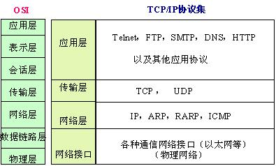

每一抽象层建立在低一层提供的服务上，并且为高一层提供服务。  

每层模型包含的协议：  
应用层：TFTP，HTTP，SNMP，FTP，SMTP，DNS，Telnet等等  
运输层：TCP，UDP  
网络层：IP，ICMP，IGMP  
数据链路层：SLIP，CSLIP，PPP，MTU  

推荐书目：**《TCP/IP详解》**

###socket介绍
首先必须明确socket不是某一层的协议，它是应用层与TCP/IP协议族通信的中间软件抽象层，它是一组编程接口(即API)，在设计模式中，socket就是门面模式（又称为外观模式，Facade），它把复杂的TCP/IP协议族隐藏在Socket接口后面，对用户来说，一组简单的接口就是全部，让socket去组织数据，以符合指定的协议。Java socket 通常也称作”套接字“，用于描述IP地址和端口，是一个通信链的句柄。应用程序通常通过”套接字”向网络发出请求或者应答网络请求。  

###两种网络传输协议TCP&UDP
####TCP
TCP是Tranfer Control Protocol的简称，是一种面向连接的保证可靠传输的协议。通过TCP协议传输，得到的是一个顺序的无差错的数据流。发送方和接收方的成对的两个socket之间必须建 立连接，以便在TCP协议的基础上进行通信，当一个socket（通常都是server socket）等待建立连接时，另一个socket可以要求进行连接，一旦这两个socket连接起来，它们就可以进行双向数据传输，双方都可以进行发送或接收操作。

####UDP
UDP是User Datagram Protocol的简称，是一种无连接的协议，每个数据报都是一个独立的信息，包括完整的源地址或目的地址，它在网络上以任何可能的路径传往目的地，因此能否到达目的地，到达目的地的时间以及内容的正确性都是不能被保证的。

####比较TCP和UDP
**TCP：**  

- 1.面向连接的协议，在socket之间进行数据传输之前必然要建立连接，所以在TCP中需要连接时间。  
- 2.TCP传输数据大小限制，一旦连接建立起来，双方的socket就可以按统一的格式传输大的数据。  
- 3.TCP是一个可靠的协议，它确保接收方完全正确地获取发送方所发送的全部数据。  

**UDP：**  

- 1.每个数据报中都给出了完整的地址信息，因此无需要建立发送方和接收方的连接。  
- 2.UDP传输数据时是有大小限制的，每个被传输的数据报必须限定在64KB之内。  
- 3.UDP是一个不可靠的协议，发送方所发送的数据报并不一定以相同的次序到达接收方。

###socket通信流程

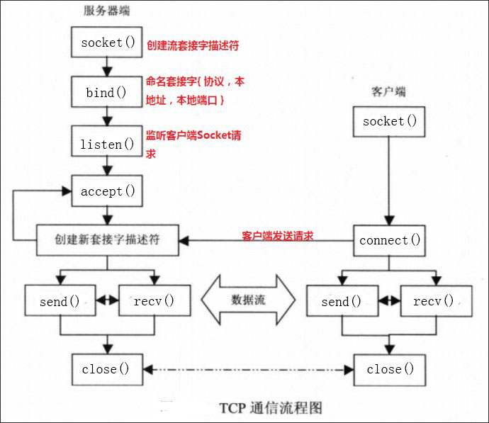

客户端的流程如下：  

- 1. 创建套接字。（socket）  
- 2. 向服务器发出连接请求。（connect）  
- 3. 和服务器端进行通信。（send/recv）  
- 4. 关闭套接字。  

服务器端的流程如下：

- 1. 创建套接字。（socket）  
- 2. 将套接字绑定到一个本地地址和端口上。（bind）  
- 3. 将套接字设为监听模式，准备接收客户端请求。（listen）  
- 4. 等待客户请求到来；当请求到来后，接受连接请求，返回一个新的对应于此次连接的套接字。（accept）  
- 5. 用返回的套接字和客户端进行通信。（send/recv）  
- 6. 返回，等待另一个客户请求。  
- 7. 关闭套接字。  

###socket实现TCP编程
`Socket`和`ServerSocket`类库位于java.net包中。`ServerSocket`用于服务器端，`Socket`是建立网络连接时使用的。在连接成功时，应用程序两端都会产生一个`Socket`实例，操作这个实例，完成所需的会话。对于一个网络连接来说，套接字是平等的，并没有差别，不因为在服务器端或在客户端而产生不同级别。不管是`Socket`还是`ServerSocket`它们的工作都是通过`SocketImpl`类及其子类完成的。  
  
**注意：**在`Socket`和`ServerSocket`中提到的端口号指TCP端口号，他们的UDP端口号不同。

###SocketImpl抽象类
抽象类`SocketImpl`是实际实现套接字的所有类的普通超类。它用于创建客户端和服务器套接字。

####SocketImpl的常用方法
以下列举一些常用到的方法，不做具体解释。方法会在Socket和ServerSocket中介绍。

	void accept()
	void create(boolean stream)	//创建一个流或者数据报套接字（DatagramSocket）。true创建流，false创建数据报套接字
	void bind(InetAddress address, int port)
	void connect(InetAddress address, int port)
	void connect(String host, int port)
	void listen(int backlog)		//设置请求队列的最大长度，即同时可连接的最大Socket的数目
	InputStream getInputStream()
	OutputStream getOutputStream()
	void close()
	
###ServerSocket类
`ServerSocket`类用于实现服务器套接字。服务器套接字等待通过网络进入的请求。它根据该请求执行一些操作，然后将结果返回给请求者。服务器套接字的实际工作由`SocketImpl`类的一个实例执行。应用程序可以更改创建套接字实现的套接字工厂，将其自身配置为创建适合本地防火墙的套接字。  

####ServerSocket的常用构造方法
1.创建一个未绑定的服务器套接字。

	ServerSocket（）
	
2.创建一个服务器套接字，并绑定到特定的端口上，端口号介于0~65525之间，这个构造方法很常用。

	ServerSocket(int port)
	
3.创建一个服务器套接字，并绑定特定的端口，请求传入信息队列最大长度（可同时连接Socket的最大数）以及服务器地址。此方法一般用于具有多个服务器的ServerSocket上。

	ServerSocket(int port, int backlog, InetAddress bindAddr)
	
####ServerSocket的常用方法
除了以下方法外，ServerSocket还继承了
1.等待监听一个套接字（socket）与其连接，并返回这个套接字，该方法会阻塞直到建立连接。

	Socket accept()
	
2。将ServerSocket绑定到特定的主机地址和端口号。如果地址为空，系统则默认选择一个临时端口和有效地本地地址绑定套接字。

	void bind(InetAddress endpoint)
	
3.关闭当前连接的套接字。

	void close()
	
4.其他方法

	InetAddress getInetAddress()				//返回这个ServerSocket的本地地址
	InetAddress getLocalSocketInetAddress()		//返回此套接字绑定的端的地址
	int getLocalPort()			//返回这个Socket监听的本地端口号
	
###Socket类
`Socket`类实现了客户端套接字。套接字是两台机器之间通信的端点。套接字的实际工作由`SocketImpl`类的一个实例执行。通过更改创建套接字实现的套接字工厂，应用程序可以将自身配置为创建适合本地防火墙的套接字。

####Socket类的常用构造方法
1.常见一个未绑定的套接字，系统默认为SocketImpl类型。

	Socket()
	
2.创建一个流套接字，并绑定到特定的IP地址和端口号。

	Socket(InetAddress address, int port)
	Socket(String host, int port)
	
####Socket类的常用方法
1.绑定套接字到一个本地地址。

	boid bind()
	
2.将此套接字连接到指定的服务器，并指定超时值。若在指定时间没有连接将被指定超时。

	void connect(InetAddress address)
	void connect(InetAddress address, int timeout)
	
3.获得这个Socket的输入流或输出流。

	InputStream getInputStream()
	OutputStream getOutputStream()
	
4.禁用输入流或输出流，半关闭的socket方式。  
在大多数时候，通信的数据单位是多行的，而socket提供的输出流输入流不能一次性将数据读取。在IO中，表示输出结束可通过关闭输出流来实现，但是在Socket中是行不通的，因为关闭socket会导致无法再从socket中读取数据了。为了解决这种问题，Java提供了两个半关闭的方法。**如果我们对一个Socket实例先后调用这两个方法，该Socket实例依然没有被关闭，只是既不能读入数据，也不能输出数据。**
	
	shutdownInput()		//关闭该Socket的输入流，程序还可以通过该Socket的输出流输出数据
	shutdownOutput()	//关闭该Socket的输出流，程序还可以通过该Socket的输入流输入数据
	
5.其他方法

	InetAddress getInetAddress()	//返回套接字连接的地址
	int getPort()					//返回套接字连接服务器的端口号
	InetAddress getLocalAddress()	//返回套接字绑定的本地地址
	int getLocalPort()				//返回套接字绑定的本地端口号
	boolean isConnected()			//返回套接字的连接状态
	boolean idBound()				//返回套接字的绑定状态
	boolean isClose()				//返回套接字是否关闭
	

###Socket实现UDP编程
UDP编程主要用到`DatagramSocket`和`DatagramPackage`这两个类，这两个类位于java.net包中。  

**注意：**`在DatagramSocket`和`DatagramPacket`中提到的端口号是指UDP端口号，它们与TCP端口号不同。

###UDP通信流程

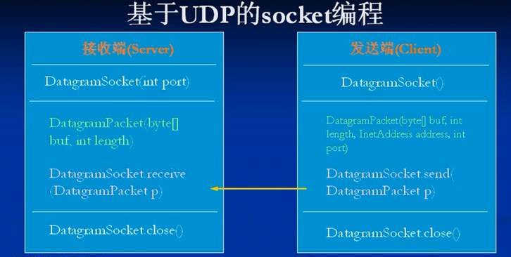

接收端流程：

- 1.调用DatagramSocket(int port)创建一个数据报套接字，并绑定到指定端口上。
- 2.调用DatagramPacket(byte[] buf, int length)建立一个**字节数组**以接收UDP包。
- 3.调用DatagramSocket类的receive()方法接收UDP包。
- 4.最后关闭数据报套接字。

发送端流程：

- 1.调用DatagramSocket()创建一个数据报套接字。
- 2.调用DatagramPacket(byte[] buf, int offset, int length, InetAddress address, int port)建立要发送的UDP包。
- 3.调用调用DatagramSocket类的send()方法发送UDP包。
- 4.最后关闭数据报套接字。

###DatagramSocket类
`DatagramSocket`类表示用来发送和接收数据报包的套接字。数据报套接字是包投递服务的发送或接收点。每个在数据报套接字上发送或接收的包都是单独编址和路由的。从一台机器发送到另一台机器的多个包可能选择不同的路由，也可能按不同的顺序到达。在`DatagramSocket`上总是启用UDP广播发送。为了接收广播包，应该将`DatagramSocket`绑定到通配符地址。在某些实现中，将`DatagramSocket`绑定到一个更加具体的地址时广播包也可以被接收。

####DatagramSocket类的常用构造方法
1.创建一个数据报套接字并将其绑定到本地主机上d饿任何可用端口。

	DatagramSocket()
	
2.创建一个数据报套接字并绑定到本地机器特定的端口上。这个方法常用。

	DatagramSocket(int port)
	
3.创建一个数据报套接字，并绑定到指定的本地地址和端口上。

	DatagramSocket(int port, InetAddress laddr)
	
####DatagramSocket类的常用方法
1.将数据报绑定到指定的地址和端口号。
	
	void bind(SocketAddress addr)
	
2.将数据包连接到指定的远程地址，当套接字连接时，不能再和其他地址通信。默认情况下是无连接的。

	void connect(InetAddress address, int port)
	void connect(SocketAddress addr)
	
3.关闭当前连接。
	
	void disconnect()

4.发送一个数据报，或者接收一个数据报。

	void send(DatagramPacket p)
	void receive(DatagramPacket p)
	
5.设置是否打开广播。

	void setBroadcast(boolean on)

6.为应用程序设置数据报套接字实现工厂，工厂只能指定一次。当应用程序创建新的数据报套接字时，会调用套接字实现工厂的createDatagramSocketImpl()方法来创建实际的数据报套接字实现。

	static void setDatagramSocketImplFactory(DatagramSocketImplFactory fac)
	
7.其他方法

	InetAddress getInetAddress()			//返回这个Socket连接的地址
	int getPort()				//返回和Socket连接地址的端口号
	InetAddress getLocalAddress()			//返回这个Socket本地绑定的地址
	int getLocalPort()			//返回此Socket本地绑定的端口号
	SocketAddress getRemoteSocketAddress()	//返回此套接字连接端点的Socket地址，包括IP地址和端口号
	SocketAddress getLocalSocketAddress()	//返回此套接字本地绑定端点的Socket地址，包括IP地址和端口号
	int set/getSendBufferSize()				//此DatagramSocket输出的缓冲区大小
	int set/getReceiveBufferSize()			//此DatagramSocket输入的缓冲区大小
	int set/getSoTimeout()
	boolean idBound()
	boolean isConnected()
	boolean isCloseed()
	...
	
###DatagramPacket类
`DatagramPacket`类表示一个数据报包。数据报包用于实现无连接分组传送服务(UDP)。每条消息仅根据包中包含的信息从一台机器路由到另一台机器。从一台机器发送到另一台机器的多个数据包可能路由不同，并可能以任何顺序到达。分组传送不保证。

####DatagramPacket类的常用构造方法
1.构造一个DatagramPacket用于接收数据，数据包中数据的起始位置为offset，长度为length。length不得大于输入缓冲区的最大长度。无offset表示起始位置为0。

	DatagramPacket(byte[] buf, int offset, int length)
	DatagramPacket(byte[] buf, int length)
	
2.构造DatagramPacket用于发送数据，将起始位置为offset，长度为length的数据报发送到指定的IP地址和端口号。

	DatagramPacket(byte[] buf, int length, InetAddress address, int port)
	DategramPacket(byte[] buf, inr offset, int length, InetAddress, int port)
	DatagramPacket(byte[] buf, int length, SocketAddress address)
	DatagramPacket(byte[] buf, int offset, int length, SocketAddress address)
	
####DatagramPacket类的常用方法
1.获取或设置此数据包中的IP地址，即目的地址。

	InetAddress getInetAddress()
	void setInetAddress(InetAddress iaddr)
	
2.获取或设置数据报中目的地址的端口号。

	int getPort()
	void serPort()

3.获取或设置数据包中的目的Socket地址。Socket地址包括IP地址和端口号。

	SocketAddress getSocketAddress()
	void setSocketAddress()

4.获取数据包中的数据，或向数据包中填入数据。

	byte[] getData()
	void setData(byte[] buf)	//将buf全部内容填入
	void setData(byte[] buf, int offset, int length)	//将buf全部数据填入，并设置偏移量，长度或用于接收数据的缓冲区长度
	
5.获取或设置数据包中数据的长度。
	
	int getLength()
	void setLength(int length)
	
6.获取或设置数据包中数据的偏移量。

	int getOffset()
	void setOffset(int offset)

	
##GUI
GUI（Graphic user interface，图形化用户界面）在Java中并不是重点。本章内容包括AWT、组件和容器、布局管理器、事件处理，Java图形，window事件。  

###AWT
AWT是Java中旧的图形化编程包，位于java.awt包中及其子包中。AWT(Abstract Window Toolkit)包括了很多类和接口，用于Java Application的GUI（Graphic User Interface）编程。GUI的各种元素由Java类实现。其中`Container`和`Component`是AWT的两个核心类。  

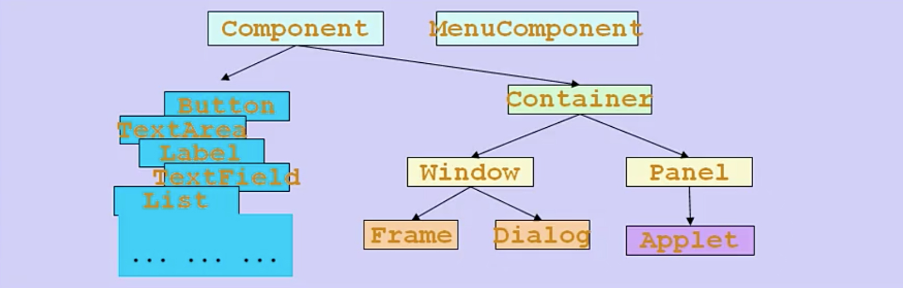

###Component类
`Component`类位于java.awt包中。Java的图形化用户界面的最基本组成部分是`Component`，`Component`类及其子类的对象用来描述以图像化的方式以图形化的方式显示在屏幕上并能与用户进行交互的GUI元素，例如，一个按钮一个标签等。一般的Component对象不能独立地显示出来。

###Container类
`Container`是Component的子类，`Container`的子类对象可以容纳别的Component的对象。`Container`对象使用add()方法向其中添加Component对象。由于`Container`是Component的子类，因此`Container`对象可以被当做Component对象添加到其他`Container`对象中。  

有两种常见的Container：

- 1.Window：其对象表示自由停泊的顶级窗口。
- 2.Panel：其对象可作为容纳其他Component对象，但不能独立存在，必须被添加到其它Container中（如Window或Applet）。  

###Frame类
`Frame`类位于java.awt包中，是Window的子类，由`Frame`或其子类创建的对象作为一个窗体。

####Frame类的常用构造方法
1.创建一个新的Frame实例，默认为不可见状态，该框架的标题为空。

	Fream()
	
2创建一个标题为字符串s的窗口。

	Frame(String s)
	
####Frame类的常用方法
1.设置窗口是否可见。该方法继承自Window类。

	setVisible(boolean b)		//该方法继承自Window类

2.设置窗体的位置和大小，x和y是窗体左上角坐标，width和height分别是窗体的宽度和高度。该方法继承自Window类。

	void setBounds(int x, int y, int width, int height)		//该方法继承自Window类
	
4.设置窗体的尺寸，width和height分别是窗体的宽度和高度。//该方法继承自Window类

	void setSize(int width, int height)		//该方法继承自Window类
	
4.设置窗体的位置。x和y是窗体左上角的坐标。该方法继承自Component类。

	void setLocation(int x, int y)	//该方法继承自Component类
	
5.设置窗体的背景颜色，参数为Color对象。该方法继承自Component类。

	setBackground(Color c)		//该方法继承自Component类
	
6.返回或设置窗体的名称。

	String getTitle()
	void setTitle(String name)
	
7.设置窗体大小是否可有用户调整。

	void setResizable(boolean resizable)
	
8.其他方法。  
从java.awt.Container类中继承的方法  

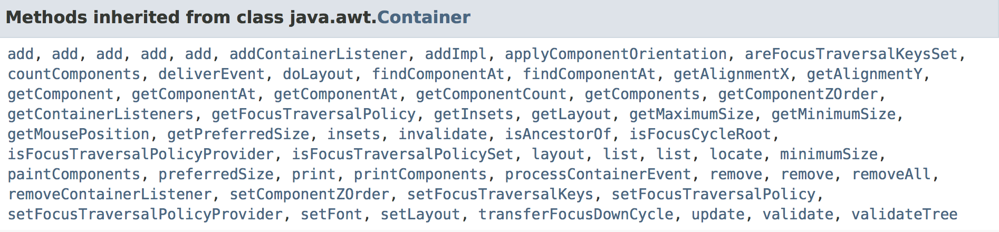

从java.awt.MenuContainer类中继承的方法  

从Java.awt.Window类中继承的方法  

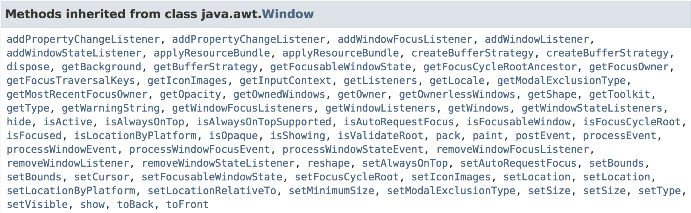

从java.awt.Component类中继承的方法  

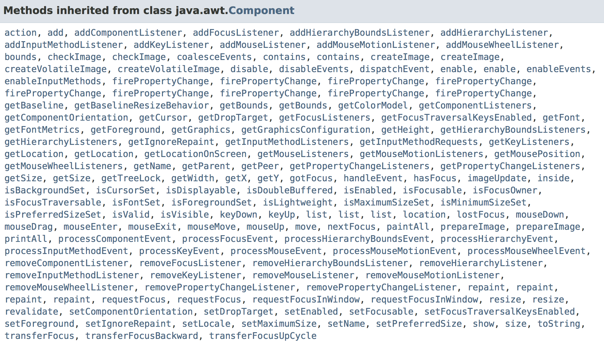

###Panel类
`Panel`类继承自Container，位于java.awt包中。`Panel`对象可以看成是容纳Component的空间，并且`Panel`对象可以拥有自己的布局管理器。但是`Panel`不能独立显示。

####Panel类的构造方法
1.创建一个新的Panel对象，且默认的布局管理器为FlowLayout。

	Panel()
	
2.创建一个系的布局管理器，并指定特定的布局管理器。

	Panel(LayoutManager layout)
	
####Panel类的常用方法
1.创建一个Panel的peer，用以修改Panel面板的外观，但不能修改其功能。

	void addNotify()
	
2.获取与此面板关联的AccessibleContext。对于面板，AccessibleContext采用AccessibleAWTPanel的形式。如有必要，将创建一个新的AccessibleAWTPanel实例。

	AccessibleContext getAccessibleContext()
	
3.其他方法。
从java.awt.Component类中继承的方法

从java.awt.Container类中继承的方法

###布局管理器
在Java中提供了布局管理器类的对象，可以管理Component在Container中的布局，不用直接设置Component的位置和大小。每个Container都有一个布局管理器对象，当容器需要对某个组件进行定位或判断其尺寸大小时，就会调用其对应的布局管理器，调用Container的setLayout()方法改变其布局管理器的对象。所有的布局管理器都实现了LayoutManager接口和Serializable接口。  

在AWT中提供5种布局管理器：

- FLowLayout
- BorderLayout
- GridLayout
- CardLayout
- GridBagLayout

###FlowLayout布局管理器
`FlowLayout`布局管理器对组件逐步定位，行内从左到右，一行排满后换行，不改变组件的大小，按组件原有尺寸显示组件，可设置不同的组件间距、行距以及对齐方式。`FlowLayout`布局管理器默认的对齐方式是居中。**`FlowLayout`布局管理器是Panel类的默认布局管理器。**  

####FlowLayout类的构造方法
1.创建一个新的FlowLayout布局管理器，默认采用居中对齐方式，水平和垂直间距为5个单位。

	new FlowLayout()
	
2.创建一个新的FlowLayout布局管理器，默认水平和垂直间距为5个单位，指定对齐方式。对齐方式只能是FlowLayout.LEFT、FlowLayout.RIGHT、FlowLayout.CENTER、FlowLayout.LEADING和FlowLayout.TRAILING中的一个。

	new FlowLayout(int align)
	
3.传建一个新的FlowLayout布局管理器，并指定特定的对齐方式，水平间距和垂直间距。

	new FlowLayout(int align, int hgap, int vgap)
	
####FlowLayout类的常用方法
1.设置对齐方式，水平间距和垂直间距。

	void setAlignment()
	void setHgap()
	void setVgap()
	
###BorderLayout布局管理器
`BorderLayout`将整个容器的布局划分为东（EAST）、西（WEST）、南（SOUTH）、北（NORTH）和中（CENTER）五个区域，组件只能被添加到指定的区域。如不指定组件加入的位置，则默认添加到CENTER区。每个区域只能加入一个组件，如若需要加入多个组件，可先加入Panel面板，再往面板中加入多个组价，否则后加入的组件会覆盖先前加入的组件。**`BorderLayout`类是Frame类的默认布局管理器。** 

####BorderLayout类的构造方法
1.创建一个新的BorderLayout布局管理器，默认组件之间间距为0。

	BorderLayout()
	
2.创建一个新的BorderrLayout布局管理器，并指定组件的水平间距和垂直间距。

	BorderLayout(int hgap, int vgap)
	
####BorderLayout类的常用方法
1.设置组件之间的水平间距和垂直间距。

	void setHgap(int hgap)
	void setVgap(int vgap)

###GridLayout布局管理器
`GridLayout`布局管理器将空间划分成规则的矩形网络，每个单元格区域大小相等。组件被添加到每个单元格中，先从左到右填满一行后换行，再从上到下。  

####GridLayout类的构造方法
1.创建一个新的GridLayout布局管理器，默认每个组件占一行，共一行。

	GridLayout()
	
2.创建一个新的GridLayout布局管理器，指定行数和列数，每个组件具有相同的大小。行数或者列数其中之一可以为0，这表示可将任意多的对象放在一起一行或者一列当中。

	GridLayout(int rows, int cols)
	
3.创建一个新的GridLayout布局管理器，并指定行数和列数，组件之间的水平间距和垂直间距。

	GridLayout(int rows, int cols, int hgap, int vgap)
	
####GridLayout类的常用方法
1.设置布局的行数和列数，指定组件之间的水平间距和垂直间距。

	void setRows(int rows)
	void setColumn(int cols)
	void setHgap(int hgap)
	void setVgap(int vgap)
	
###布局管理器总结
使用布局管理器时，布局管理器负责各个组件的大小和位置，因此用户无法在这种情况下设置物件大小和位置属性，如果试图使用Java语言提供的setLocation()、setSize()、setBounds()等方法，则都会被布局管理器覆盖。如果用户需要亲自设置组件大小或位置，则应该取消容器的布局管理器。取消方式如下：

	setLayout(null);
	
Frame是一个顶级窗口，Frame的缺省布局管理器为BorderLayout。Panal的缺省布局管理器为FlowLayout，Panel无法单独显示，必须添加到某个容器里面。当把Panel作为一个组件添加到某个容器中后，该Panel仍然可以有自己的布局管理器。

###事件监听
####事件监听模型

为组件添加监听器，必须实现监听器接口，然后new一个实现了监听器接口的对象，将对象做为监听器添加到组件当中，该组件就可以对注册的事件进行监听。一旦该事件被触发，就会执行该监听对象中相应的方法。

以TextField为例说明在组件中添加监听器：

- TestField对象可能发生Action（光标在文本框内敲回车）事件。与该事件对应的事件类是java.awt.ActionEvent。
- 用来处理ActionEvent事件是实现了java.awt.ActionListener接口的类的对象。ActionListener接口中定义有方法：
		<pre>public void actionPerformed(ActionEvent e)</pre>
- 实现该接口的类要在该方法中添加处理该事件（Action）的方法。
- 使用addActionListener(ActionListener l)方法为TextField对象注册一个ActionListener对象，当TextField对象发生Action事件时，会生成一个ActionEvent对象，该对象作为参数传递给ActionListener对象的actionPerformed()方法在方法中可以获取该对象的信息，并做相应的处理。

###Graphics抽象类
`Graphics`类是所有图形上下文的抽象基类，允许应用程序绘制在各种设备上实现的组件以及屏幕外图像。`Graphics`对象封装了Java支持的基本渲染操作所需的状态信息。此状态信息包括要绘制的Component对象，用于渲染的坐标原点，当前颜色等。同时`Graphics`类中也封装了许多绘图方法。  

每个Component类都有一个paint(Graphics g)用于实现绘图目的，且paint()是自动调用完成的。如果想要重画该Component对象，则需要调用repaint()方法。repaint()会调用update()方法，update()方法再去调用paint(Graphics g)方法完成重画，所以每次重画都会调用paint(Graphics g)方法。

####Graphics抽象类的构造方法
1.构造一个新的Graphics对象。

	protected Graphics()

####Graphics抽象类的常用方法
1.使用当前字体和颜色，绘制出byte数组的内容。

	drawBytes(byte[] data, int offset, int length, int x, int y)
	
2.使用当前字体和颜色，绘制出char数组的内容。

	drawChars(char[] data, int offset, int length, int x, int y)
	
3.在指定的位置绘制指定大小的图片。

	drawImage(Image img, int x, int y, int width, int height, ImageObserver observer)
	
4.在指定位置画一条直线。

	drawLine(int x1, int y1, int x2, int y2)
	
5.绘制一个椭圆形的轮廓或绘制一个实心的椭圆。x，y是要绘制椭圆的左上角坐标，即椭圆的外接矩形的左上角坐标，width，height分别是要绘制的椭圆的宽度和高度。

	void drawOval(int x, int y, int width, int height)
	void fillOval(int x, int y, int width, int height)
	
6.绘制一个矩形的轮廓或绘制一个实心的矩形。x，y是要绘制矩形的左上角坐标，width，height分别是要绘制矩形的宽度和高度。

	void drawRect(int x, int y, int width, int heigth)
	void fillRect(int x, int y, int width, int height)
	
7.绘图结束时，释放Graphics对象所占用的系统资源。在调用dispose()方法后，Graphics对象不能再被使用。

	void dispose()
	

###知识点
####1.持有对方引用
**问题：**实现一个有界面的加法计算器。如图，分别在第一个框和第二个框中输出两个加数，点击等号使结果显示在等号后面的方框中。

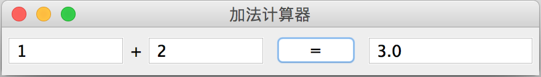

分析：当点击等号时，会传递一个关于按钮的ActionEvent对象到监听器对象，但这并不包含关于两个加数的任何信息。如何能在点击按钮的时候同时也拿到关于两个加数与和的信息？我们可以在实现监听器接口的类中声明一个计算器的对象，同时重写一个构造方法。当需要创建新的监听器对象时，同时也传入计算器对象的引用，那么在监听器对象中就可以拿到计算器对象的全部内容，并可修改计算器对象的内容。

	/*
	*实现计算器类
	*/
	class MyFrame extends Frame {
		...
		//为按钮添加监听器时，传入当前对象的引用
		btn.addActionListener(new Monitor(this));	
		...
	}
	
	
	/*
	*实现监听器接口
	*/
	class Monitor implements ActionListener {
		MyFrame mf = null;	//对方引用
		
		public Monitor(MyFrame mf) {
			this.mf =mf;
		}
		
		public actionPerformed(ActionEvent e) {
			...
		}
		
	}
	
####2.内部类
从上面问题中继续分析，当然按照持有对方引用这种方法来实现这样的计算器没有任何问题，但是如果这个监听器只是为这个计算器类服务的话，有没有更好的解决方案？  

如果该监听器类只为这个计算器类服务，按照持有对方引用这种方式，就会产生一种隐患。因为该监听器类只是一个普通的类，实际上它也可以在其他任何地方实例化，并为其他对象提供服务，而这并不是我们想看到的结果。如何从理论上保证该监听器类只能为这个计算器类提供服务？答案就是将该监听器类作为计算器的内部类。因为内部类只能被其所在的类直接访问，其他任何类都无法直接访问，这从根本上就消除了这样的隐患。

	/*
	*实现计算器类
	*/
	class MyFrame extends Frame {
		//三个显示数字的文本框
		TextFiled num1;
		TextFiled num2;
		TextFiled num3;
		
		...
		btn.addActionListener(new Monitor());
		...
		
		
		/*
		*实现了监听器接口的内部类
		*MyFrame的成员变量和方法也可以作为Monitor的成员变量和方法使用，不需要在传入MyFrame的引用
		*/
		class Monitor implments ActionListener {
			public void actionPerformed(ActionEvent e) {
				...
			}
		}
	}
	
####3.匿名内部类
接着上面的问题。在上述例子中，Monitor类只为按钮提供服务。话句话说，它的作用域只在btn.addActionListener()这句话中。这个时候我们可以使用一种更加简便的方法为按钮添加事件监听器，那就是匿名内部类。  

可以发现，addActionListener(ActionListener l)方法需要出入一个对象作为方法参数，并且这个对象的类实现了ActionListener接口。此时我们可以直接在该方法的括号里声明并创建一个符合条件的类作为参数传入，这种方式称为匿名内部类，匿名内部类也拥有访问外部类的成员变量和成员方法的权限。只是它除了在这句话以外的任何地方都不能被访问。匿名内部类一般适用于类的内容简短，该类只在某一句话当中被使用这种情形。

	/*
	*实现计算器类
	*/
	class MyFrame extends Frame {
		
		...
		
		//使用匿名内部类为按钮注册监听器
		btn.addActionListener(new ActionListener() {
			public void actionPerformed(ActionEvent e) {
				....
			}
		});
		
		...
	}
	
在这个例子中我们new ActionListener(){}表示该匿名内部类是实现了该接口的一个类，如果new ActionAdapter(){}表示该匿名内部类是继承了该ActionAdapter类的一个类。因此，无论是继承还是实现接口，匿名内部类的写法都是相同的。  

####4.适配器
接上面的问题继续叙述。ActionListener接口只有一个方法需要实现，无论是直接实现ActionListener接口，还是作为匿名内部类来实现都是比较容易的。可是对于其他的接口（例如MouseListener接口）内有5个方法需要实现，即便是我们只想使用其中的1个方法，也要实现另外4个方法才行。无论是直接实现，还是匿名内部类都是比较麻烦的。幸好的是，java为我们提供了一种适配器模式，可以解决这种问题。  

对于每个XXXListener接口，都有一个与其对应的XXXAdapter类。这个类称为该接口的适配器，它实现了该接口中的所有方法，只不过这些方法都是空方法。如果只是想使用一个接口中众多方法中的一个方法或少数几个方法，就可以通过继承该接口对应的适配器，并重写其中的某个方法即可。

	/*
	*MouseListener接口源码
	*/
	interface MouseListener {
		void mouseClicked(MouseEvent e);
		void mouseEntered(MouseEvent e);
		void mouseExited(MouseEvent e);
		void mousePressed(MouseEvent e);
		void mouseReleased(MouseEvent e);
		
		...
	}
	
	/*
	*MouseAdpater适配器源码
	*/
	class MouseAdapter implements MouseListener {
		void mouseClicked(MouseEvent e) {};
		void mouseEntered(MouseEvent e) {};
		void mouseExited(MouseEvent e) {};
		void mousePressed(MouseEvent e) {};
		void mouseReleased(MouseEvent e) {};
		
		...
	}
	
如果要给窗口添加一个鼠标的点击事件，则使用继承MouseAdapter适配器重写相应方法比直接继承MouseListener接口方便的多。

	MyFrame extends Frame {
	...
	
	window.addMouseListener(new MouseAdapter() {
		public void mouseClicked(MouseEvent e) {
			...
		}
	});
	
	...
	}
	

##日期时间处理

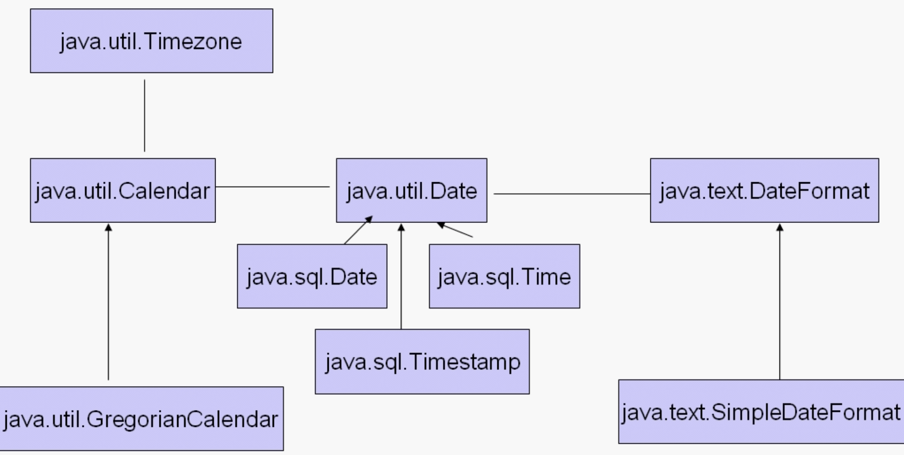

上图中包含了Java中所有处理时间的类。其中：  
**java.util.Date:**`Date`类表示精确到毫秒的时间，并且`Date`中把日期解释为年与日、小时分钟秒的方法已经废弃。应该使用Calendar类实现日期和时间字段之间的转换，使用DateFormat类格式化和分析日期字符串。创建一个新的`Date`对象时，默认将系统当前时间分装到Date对象内。`Date`类是一个很老且很简陋的处理时间类。  

**java.util.Calendar:**`Calendar`类是一个抽象类，它为某精确时间与一组诸如YEAR、MONTH、DAY_OF_MONTH、HOUR等日历段之间转换提供了一组方法，并为操作日历字段提供了一些方法。精确时间可用毫秒来表示，它是距格林威治标准时间1970年1月1日00:00:00的偏移量（即经过的毫秒数）。`Calendar`提供了getInstance()方法已获得此类型的一个通用对象。`Calendar`类的getInstance()方法返回一个Calendar对象，其日历字段已由当前日期和时间初始化。  

**java.text.DateFormat:**`DateFormat`是一个日期/时间格式化的抽象类。它可以将将日期/时间格式化（日期->字符串）、解析（字符串->日期）和规范化。将日期表示为Date对象，或表示为从GMT（格林威治时间1970年1月1日 00:00:00这一刻开始的毫秒数）。

**java.text.SimpleDateFormat:**`SimpleDateFormat`类是DateFormat类的一个子类，通常使用`SimpleDateFormat`类处理日期。它使用特定的方式来格式化和分析日期。它允许进行格式化（日期->字符串）、分析（字符串->日期）和规范化。`SimpleDateFormat`类使得可以任意选择用户定义的日期-时间格式的模式。但是仍建议通过DateFormat类中的getTimeInstance()、getDateInstance()或getDateTimeInstance()方法来获取日期-时间的模式。  

**java.util.GregorianCalendar:**`GregorianCalendar`类是Calendar类的一个子类，提供了世界上大多数国家使用的标准的日历系统。  

**java.util.TimeZone:**`TimeZone`类表示时区偏移量。通常可以使用getDefault()方法根据程序运行的时区创建一个`TimeZone`对象。也可以使用getTimeZone()方法获取一个地方的时区。也可以使用getAvailableIDs()方法遍历所有支持的时区ID。  

`java.sql.Date`、`java.sql.Time`、`java.sql.Timestamp`都是java.util.Date的子类。它们专门用来处理和数据库相关的时间。其中`java.sql.Date`只包括日期，`java.sql.Time`只包括时间，而`java.sql.Timestamp`包含日期和时间。

###Date类
`java.util.Date`类表示特定的时刻。精确到毫秒。`Date`类有两个附加功能，它允许将日期解释为年，月，日，小时，分钟和秒钟值，还允许格式化和分析日期字符串。不幸的是，这些功能的API不适合国际化。从JDK 1.1开始，应使用Calendar类在日期和时间字段之间进行转换，并使用DateFormat类来格式化和分析日期字符串。`Date`中的相应方法已弃用。

####Date类的常用构造方法
1.创建一个Date对象，并使用当前操作系统时间初始化，精确到毫秒。

	Date()
	
2.创建一个时间，并使用指定的毫秒数初始化。该毫秒数表示从1970年1月1日00:00:00经过的毫秒数。

	Date(long date)
	
####Date类的常用方法
1.判断此日期时候在指定的日期之后或之前。

	boolean after(Date when)
	boolean before(Date when)
	
2.设置此Date对象的时间。表示从1970年1月1日00:00:00开始经过的毫秒数。

	void setTime(long time)
	
3.返回该Date对象时间从格林威治时间开始到现在的毫秒数。

	long getTime()
	
3.将Date对象转换为特定的字符串格式.“dow mon dd hh:mm:ss yyyy”，即“星期 月份 天 小时:分钟:秒 年”的格式。

	String toString()
	
###Calendar类
`Calendar`类是一个抽象类，它为特定瞬间与一组诸如YEAR、MONTH、DAY_OF_MONTH、HOUR等日历字段之间的转换提供了一些方法，并为操作日历字段（例如获得下星期的日期）提供了一些方法。瞬间可用毫秒值来表示，它是距历元（即格林威治标准时间 1970 年 1 月 1 日的 00:00:00.000，格里高利历）的偏移量。`Calendar`类提供了一个静态方法来获取一个通用的`Calendar`对象。  

####Calendar类的常用构造方法
1.创建一个日历对象，使用默认的时区和FROMAT locale。

	Calendar()
	
2.创建一个日历对象，使用指定的时区和Locale。

	Calendar(TimeZone zone, Locale alocale)
	
####Calendar类的常用方法
1.这是一个静态方法，返回一个Calendar对象。

	static Calendar getInstance()		//基于当前时间使用默认的时区和locale
	static Calendar getInstance(TimeZone zone)		//基于当前时间使用默认的时区和特定的locale
	static Calendar getInstance(Locale alocale)		//基于当前时间使用特定的的时区和默认的locale
	static Calendar getInstance(TimeZone zone, Locale alocale)		//基于当前时间使用特定的时区和特定的locale
	
2.使用Calendar对象的time值返回一个Date对象。将一个Date对象转换成一个Calendar对象。这两个方法实现了Calendar对象和Date对象之间的相互转换。

	final Date getTime()
	fina void setTime(Date date)
	
3.返回该Calendar对象对应的毫秒数（从格林威治时间算起）。或者使用毫秒数设置Calendar对象的当前time值。

	long getTimeMillis()
	void setTimeMillis(Long millis)
	
4.返回一个该Calendar对象指定区域的，如果日历的任何一个字段超出了范围，会抛出一个异常。field的值包括Calender.YEAR、Calender.MONTH、Calender.DAY\_OF\_MONTH、Calender.DAY\_OF\_WEEK、Calender.HOUR\_OF\_DAY、Calender.MINUTE、Calender.SECOND，这些值分别表示年、月-1、日、星期、时、分、秒。  
如果要取日期中的月份，应该取出后再加1。
	
	int get(int field)
	
5.将给定的日历字段设置为指定的值。

	void set(int field, int value)
	final void set(int year, int month, int date)	//设置日历的中YEAR、MONTH、DAY_OF_MONTH字段的值
	final void set(int year, int month, int date, int hourOfDay, int minute)	//设置日历中的YEAR、MONTH、DAY_OF_MONTH、HOUR_OF_DAY、MINUTE字段的值
	final void set(int year, int month, int date, int hourOfDay, int minute, int second)
	
6.设置Calendar中特定的字段的值为undefine（未定义），使用isSet()返回为false。

	final void clear()				//清除所有字段
	final void clear(int field) 	//清除指定字段
	
###SimpleDateFromat类
在Java中，我们使用`java.text.SimpleDateFormat`类格式化时间，`SimpleDateFormat`类继承自DateFormat类，DateFormat类继承于Format类，Format类中也提供了很多对信息，数字，日期等等内容的格式化。`SimpleDateFormat`类除了提供日期格式化的方法，还具有将字符串解析成Date对象的功能。

####SimpleDateFormat类的常用构造方法
1.创建一个SimpleDateFormat对象，并使用指定的语言环境，日期格式和模式。

	SimpleDateFormat()		//使用默认的语言环境，日期格式和模式
	
2.创建一个SimpleDateFormat对象，并指定模式。  
**注意：**此构造函数可能不支持所有语言环境。为了全面覆盖，请使用DateFormat类中的工厂方法，这相当于调用SimpleDateFormat（pattern Locale.getDefault（Locale.Category.FORMAT））方法。

	SimpleDateFormat(String pattern)	
	
3.创建一个SimpleDateFormat对象，指定模式和语言环境。

	SimpleDateFormat(String pattern, Locale locale)
	
4.创建一个SimpleDateFormat对象，指定模式和日期格式。

	SimpleDateFormat(String pattern, DataFormSymbols formatSymbols)
	
####SimpleDateFormat类的常用方法
1.将给定的Date格式化为指定的“日期/时间”格式，并以StringBuffer的格式返回。

	StringBuffer format(Date date, StringBuffer toAppendTo, FieldPosition pos)
	
2.从给定的字符串，指定的第pos个位置开始解析，解析结果包装成一个Date类返回。解析模式在创建SimpleDateFormat对象的时候已经指定。该方法会抛出一个ParseException异常。

	Date parse(String source, ParsePosition pos)		
3.该方法来自DateFormat类，将一个Date对象格式化为“日期/时间”字符串并返回。

	String format(Date date)	
	
4.该方法来自DateFormat类，将给定的字符串，从第0个位置开始解析成Date对象，并返回。该方法会抛出一个ParseException异常。

	Date parse(String source)
	
####日期和时间模式
在SimpleDateFormat类中日期和时间格式由日期和时间模式字符串指定。在日期和时间模式字符串中，从'A'到'Z'以及从'a'到'z'的未加引号的字母被解释为代表日期或时间字符串组成部分的模式字母。可以使用单引号（'）引用文本以避免解释。“''”代表单引号。所有其他字符不解释；它们只是在格式化时被复制到输出字符串中，或者在解析过程中与输入字符串匹配。

定义了以下模式字母（从'A'到'Z'以及从'a'到'z'的所有其他字符都被保留）：  

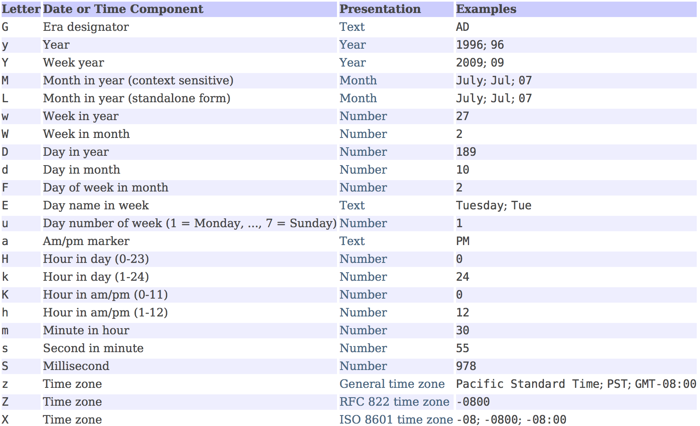

模式字符通常会被重复使用，因为它们的数量代表了显示格式。格式化中，模式字母的数量大于等于4，则显示完整格式，否则使用简写格式。  

以下是不同模式显示日期的例子：  

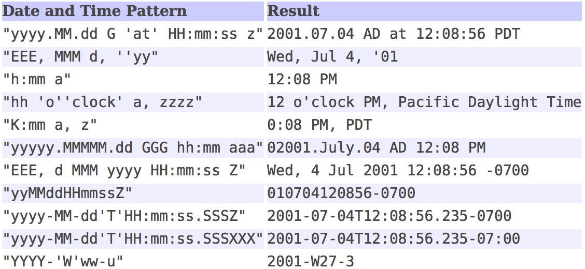

###配置单例Formatter
由于在一个项目中时间格式化和解析的格式一般只有一种(我们应该不希望格式化之后的time到最后反而解析不出来)，因此我们没有必要每次使用时都new出一个Formatter来，这样不光会造成性能下降还有可能造成时间形式不统一而出错。因此，我们可以在Sring的容器中装载一个Formatter Bean，使用时@Autowired就可以了：

	<!-- 配置时间格式化器 -->
	<bean id="dateFormatter" class="java.text.SimpleDateFormat">
		<constructor-arg value="yyyy-MM-dd HH:mm:ss"/>
	</bean>
	
	@Autowired
	private DateFormat dateFormatter;
	...
	String time = dateFormatter.format(System.currentTimeMillis());
	
		
[Java日期时间处理-ImportNew](http://www.importnew.com/17921.html)

##正则表达式
RegularExpressions(正则表达式)是处理字符串的利器。Java中的正则表达式API在java.util.regex包下，其中包括两个重要的类，`Pattern`（模式）和`Matcher`（匹配器）。正则表达式主要用来进行字符串匹配（字符匹配）、字符查找、字符替换。  

###Pattern类
`Pattern`类就是正则表达式编译后的表示，指定为字符串的正则表达式必须首先编译到该类的实例中。然后可以使用生成的模式创建匹配任意字符序列与匹配正则表达式的`Matcher`对象。`Pattern`类的实例是不可变的，可供多个并发线程安全使用。  

Pattern类的构造方法是私有的，因此不能直接new一个`Pattern`对象。`Pattern`对象是通过调用compile方法而返回的。

####Pattern类的常用方法
1.将给定的正则表达式编程成模式，并指定标志。flags的值有CASE_INSENSITIVE（忽略大小写），MULTILINE，DOTALL，UNICODE\_CASE，CANON\_EQ，UNIX\_LINES，LITERAL，UNICODE\_CHARACTER\_CLASS和COMMENTS。

	static Pattern compile(String regex)
	static Pattern compile(String regex, int flags)

2.创建一个匹配器，并将要匹配的文本传入。

	Matcher matcher(CharSequence input)

3.编译给定的正则表达式，并尝试匹配给定的输入。这种表达方式与Pattern.compile(regex).matcher(input).metches()相同。如果要多次重用某种模式，先编译这种模式再多次调用效率高很多。

	static boolean metches(String refex, CharSequence input)
	
4.按照给定的字符序列将文本拆分成字符串数组返回。limit限制模式应用的次数，模式最多应用不超过n-1次。

	String[] spilt(CharSequence input)	//无应用限制，全部拆分
	String[] spile(CharSequence input, int limit)
	
5.返回该模式编译的泽正则表达式。

	String pattern()
	
6.返回该模式设置的标志。

	int flags()
	
###Mather类
`java.util.regex.Matcher`是通过解释模式对字符序列执行匹配操作的引擎，通过调用模式（Pattern）的匹配器方法（matcher）从模式创建匹配器。`Matcher`类用于匹配一段文本中多次出现一个正则表达式，也适用于多文本中匹配同一个正则表达式。Matcher类的实例对于并发线程的多个实例是不安全的。  

`Matcher`对象不能通过构造方法创建，正确的方法是使用Pattern类中的matcher()方法。一旦创建，匹配器就可以用来执行三种不同类型的匹配操作：matches、looKingAt、find。

####Matcher类的常用方法
1.将整个文本和模式进行匹配，并返回是否匹配成功。如果匹配成功，可以使用start()，end()，group()方法返回更多的信息。

	boolean matches()
	
2.对文本的开头匹配正则表达式，返回是否匹配成功。与matches()方法不同的是，不需要对整个文本匹配。 

	boolean lookingAt()
	
3.该方法尝试在文本中查找下一个和正则表达式匹配的子串，并返回是否匹配成功。如果在文本中多次匹配，每次调用该方法都会返回下一个子串，也就是说再次调用find()方法，是从上一次查找结束的位置开始查找，默认第一次从文本的起始位置开始查找。每次匹配成功后，可以调用start()、end()方法返回匹配成功的子串的开始位和结束位的下一个位置。

	boolean find()
	boolean find(int index)		//重置匹配器，从指定位置重新开始查找匹配字符串

4.重置匹配器，丢弃其所有显示状态信息，将append位置设为0，并返回新的Matcher匹配器。使用find()方法也会从文本的第0个位置开始匹配。

	Matcher reset()
	Matcher reset(CharSequence input)		//设置新的匹配的文本，代替原来的字符串

5.若匹配成功，则返回该子串的起始位置和结束位置的下一个位置。

	int start()
	int end()
	
6.使用该方法访问一个分组。一个正则表达式可以有多个分组。每个分组由一对括号标记。想要访问正则表达式中某分组匹配的文本，可以把分组编号传入group(int groupNo)方法。  
分组的编号依左括号出现的次序，编号从1开始。0代表全部分组。

	String group()
	String group(int group)
	
7.使用输入的字符串替代与模式匹配的输入文本中的子串，并以字符串形式返回替代后的结果。
	
	String replaceAll(String replacement)		//替代输入文本中所有匹配成功的子串
	String replaceFirst(String replacement)		//只替代第一个匹配成功的子串
	
8.将当前匹配子串替换为指定字符串replacement，并将从上次匹配结束后到本次匹配结束后之间的字符串sb添加到一个StringBuffer对象中，最后返回其字符串表示形式。  
该方法执行的步骤：

- 它从待匹配文本的append位置开始读取字（默认第0个位置开始），并把字符添加到StringBuffer中。一直读到当前匹配子串前停止（即start()-1处）。
- 将给定的替换字符串添加到StringBuffer中。
- 将匹配器的append位置设置为当前匹配子串的最后一个字符的位置加1（即end()处）。  

<pre>Matcher appendReplacement(StringBuffer sb, String replacement)</pre>

9.将最后一次匹配工作后剩余的字符串添加到一个StringBuffer对象里。

	Matcher appendTail(StringBuffer sb) 

一般情况下，appendReplacement()和appendTail()配合使用，在替换结束最后一个匹配子串后，使用appendTail()将原文本剩余部分添加到StringBuffer内。例如：  

	while(m.find()) {
		m.appendReplacement(buf, str);
	}
	m.appendTail(buf);
	
10.设置或者返回待匹配文本的匹配范围。

	Matcher region(int start, int end)	//设置匹配文本的起始位置和结束位置
	int regionStart()	//返回匹配的起始位置
	int regionEnd()		//返回匹配的截止位置
	
###Java正则表达式的语法
为了更有效的使用正则表达式，需要了解正则表达式语法。正则表达式语法很复杂，可以写出非常高级的表达式。**只有通过大量的练习才能掌握这些语法规则**。下面列举了部分常用的正则表达式语法，完整的详细语法请参阅文档。

####字符
字符是正则表达式中最常使用的表达式，作用是简单的匹配一个确定的字符。例如：John，这个简单的正则表达式将会在输入文本中匹配John文本。  
可以在正则表达式中使用任意的英文字符，也可以使用8进制，16进制或者unicode编码表示的字符。“.”表示任意字符。

####字符分类
字符分类是一种结构，一个字符分类匹配输入文本中的一个字符，对应字符分类中多个允许的字符。字符分类使用一对“[]”这样的括号表示。

####预定义字符分类
除了我们自己可以字符分类外，正则表达式中有一些预定义字符分类也可以使用。例如：

- \d表示0~9的数字，[0-9]
- \D表示非0~9的其他字符，[^0-9]
- \s表示任意的空白字符，包括[1️⃣\t\n\x0B\f\r]，其中“1️⃣”表示空格
- \S表示除了空白字符以外的其他字符，[^\s]
- \w表示任意的单词字符，[a-zA-Z0-9_]
- \W表示费单词字符，[^\w]
- \b表示单词的边界
- \B表示除了单词边界的其他字符

####边界匹配
正则表达式支持便捷的边界匹配，例如单词边界，文本的开头和结尾。

- ^匹配行首
- $匹配行位

####量词匹配
量词匹配可以指定一个字符可以0次，1次或者多次。

- *表示0次或多次
- +表示1次或多次
- ？表示0次或者1次
- {n}表示字符出现n次
- {n,}表示字符至少出现n次
- {n,m}表示字符出现次数处于n到m之间

量词匹配有三种模式，分别是饥饿模式（Reluctant quantifiers），贪婪模式（Greedy quantifiers）和独占模式(Possessive quantifiers)，默认为贪婪模式。饥饿模式匹配尽可能少的文本，贪婪模式匹配尽可能的文本，独占模式也匹配尽可能多的文本，但是独占模式更加过分，甚至会导致剩余的正则表达式匹配失败。

- .*?表示饥饿模式，问号结尾表示饥饿模式
- .*表示贪婪模式，结尾什么也不加表示贪婪模式，默认为贪婪模式
- .*+表示独占模式，加号结尾表示独占模式

####逻辑操作符
正则表达式也包括逻辑的与或非。其中与操作是默认的，像前面的例子中“John”就是要匹配第一个字符是“J”，并且第二个字符是“o”，第三个字符是“h”，第四个字符是“h”的文本。

- |表示或，例如John|hurt
- ^表示非，当^放在[]里面第一个时表示文本的开头，放在括号外面表示非操作

####分组
一个正则表达式可以有多个分组。例如：(John)(.\*)，其中括号不是正则表达式匹配的内容，只是用来分组，John表示第一个分组，.\*表示第二个分组。  
除了这种分组，还有嵌套分组。例如((John)(.\*))表示一个嵌套分组的例子，其中John.\*表示第一个分组，John表示第二个分组，.\*表示第三个分组。  
分组的编号是根据没每对括号的左括号出现的先后排序的。

关于正则表达式的规则和例子：  
[Java 正则表达式-ImportNew](http://www.importnew.com/19381.html)

##反射机制
###动态加载
程序运行过程：

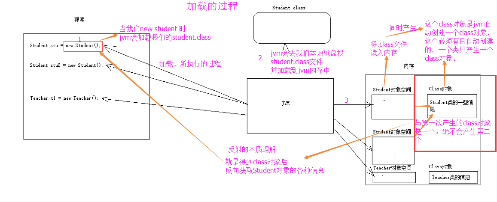

ClassLoader的类加载机制：  
所有的类并非一次性加载，而是运行期间动态加载。加载类时，其中的static语句块在加载后执行一次，dynamic语句块每次new新的对象都会执行一次，等同于构造方法中的语句，dynamic语句块用得比较少。

###JDK内置的ClassLoader
ClassLoader就是类加载器。理解ClassLoader的加载机制，有利于我们编写出更加高效的代码。ClassLoader的具体作用就是讲class文件加载到jvm虚拟机中，程序就可以正确运行了，但是启动jvm的时候，并不会一次性加载所有的class文件，而是根据需要去动态加载。  

JDK内置的ClassLoader非常多，最常用的包括下面3个。其中Bootstrap ClassLoader是由C++编写，Extesion ClassLoader、Application和Other ClassLoader是由Java编写。

####1.Bootstrap ClassLoader  
Bootstrap ClassLoader是最顶层的加载类，主要加载核心类库，jre\lib下的rt.jar、resources.jar、charsets.jar和class等。 另外需要注意的是可以通过启动jvm时指定`-Xbootclasspath`和路径改变Bootstrap ClassLoader的加载目录。

####2.Extesion ClassLoader
扩展的类加载器，负责jdk的扩展类，加载目录jre/lib/ext目录下的jar包和class文件。也可以加载`-D java.ext.dirs`选项指定的目录。

####3.Application ClassLoader
加载当前应用的classpath的所有类，也就是用户自定义的类。使用ClassLoader.getSystemClassLoader()方法可以获得系统ClassLoader，也就是Application ClassLoader。

####4.Other ClassLoader
包括SecureClassLoader和URLClassLoader等。

###JDK Class Loader的层次关系
下图为JDK中主要的ClassLoader之间的层次关系，需要说明的是这种层次关系不是继承关系，而是在下层中的ClassLoader中包含上层的ClassLoader的引用，例如在Application ClassLoader中拥有Ext ClassLoader的引用，Extesion ClassLoader被称为Application ClassLoader的父加载器。  
但是Extesion ClassLoader的父类为null，这是因为Bootstrap ClassLoader是由C/C++编写的，它本身是虚拟机的一部分，并不是一个Java类，也就无法在java代码中获取它的引用。JVM启动时通过Bootstrap类加载器加载rt.jar等核心包中的class文件，int.class和String.calss等类都是由它加载。JVM初始化sun.misc.Launcher并创建Extesion ClassLoader和Application ClassLoader实例、并将ExtClassLoader设置为AppClassLoader的父加载器。 

ClassLoader在加载Class时，首先会检查它的上一层ClassLoader是否已经加载过了，如果已经加载过了，则不再重新加载。而是直接把已存在的ClassLoader作为引用传入当前Class中。JDK内置的3个类加载器的加载顺序依次为Bootstrap ClassLoader、Extesion ClassLoader和Application ClassLoader。

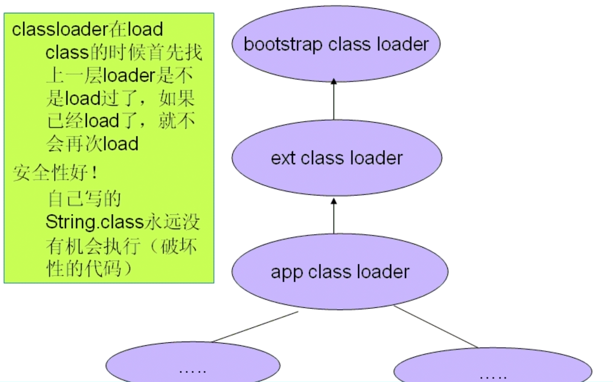

[一看就懂，超详细java中的ClassLoader详解](https://blog.csdn.net/briblue/article/details/54973413)

###反射机制的概念
在Java中的反射机制是指在运行状态中，对于任意一个类都能够知道这个类的所有属性和方法；并且对任意一个对象都能够调用它的任意一个方法，这种动态获取信息以及动态调用对象方法的功能称为Java语言的反射机制。  

在Java程序中许多对象在运行是都会出现两种类型：编译时类型和运行时类型。编译时类型由声明对象时实用的类型决定，运行时类型由实际赋值给对象的类型决定。如：

	Person p = new Student();
	
其中编译时类型为Person，运行时类型为Student。除此之外，程序在运行时还可能接受到外部传入的对象，该对象的编译时类型为Object，但是程序优势需要调用该对象的运行时类型的方法。为了解决这些问题，程序需要在运行时法线对象和类的真实信息。然而，如果编译时根本无法预知该对象和类属于哪些类，程序只能依靠运行时信息来发现该对象和类的真实信息，此时就必须使用反射机制了。

###Java反射API
Java反射API位于包java.lang.reflect内，用来生成JVM中的类、接口或者对象的信息。这个包内封装了Field、Constructor、Method、Proxy和InvocationHandlerd等类。  

- **Class类：**位于Java.lang包中，反射的核心类，可以获取类的属性方法等信息。
- **Field类：**位于java.lang.reflect包中，表示类的成员变量，可以用来获取和设置类中的属性值。
- **Method类：**位于java.lang.reflect包中，表示类的方法，他可以用来获取类中的方法信息或者执行方法。
- **Constructor类：**位于java.lang.reflect包中，表示类的构造方法。

###Class类
`java.lang.Class<T>`类的实例表示正在运行的Java应用程序中的类和接口。也就是jvm中有N多的实例每个类都有该Class对象（包括基本数据类型）。`Class`没有公共构造方法。`Class`对象是在加载类时由Java虚拟机以及通过调用类加载器中的defineClass()方法自动构造的。也就是这不需要我们自己去处理创建，JVM已经帮我们创建好了。`Class`类的作用是运行时提供或获得某个对象的类型信息，这些信息也可用于反射。  

####Class类的原理
我们都知道所有的java类都是继承了object这个类，在object这个类中有一个方法：getclass()。这个方法是用来取得该类已经被实例化了的对象的该类的引用，这个引用指向的是Class类的对象。我们自己无法生成一个Class对象（构造函数为private)，而这个Class类的对象是在当各类被调入时，由Java虚拟机自动创建Class对象，或通过类装载器中的defineClass方法生成。我们生成的对象都会有个字段记录该对象所属类在Class类的对象的所在位置。如图所示：

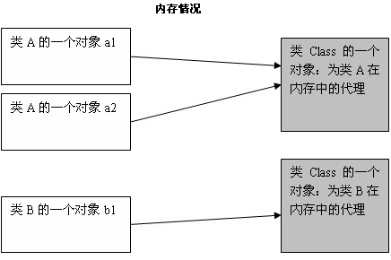

####Class类的部分常用方法
Class类中有很多常用方法，具体用法请阅读Java API文档。  

1.该方法是静态方法，返回与具有给定字符串名称的类或接口关联的Class对象。  

	static Class<?> forName(String name) throws ClassNotFoundException
	
获取Class对象的另外两种方法：

	obj.getClass()		//obj表示对象
	Object.class			//Objet表示类名，表明任何一个类都有一个隐含的成员变量
	
2.创建一个由此Class对象表示的类的新实例，但是这种方法产生的实例是不精确的，因为它们都被看做是Object类型，使用时需要强制转换为原本的类型。  
使用newInstance()方法创建对象的前提必须是，该类拥有一个public权限无参的构造方法，否则会抛出一个异常。如果没有public权限的无参构造方法，需要先获取该类的构造方法，然后再使用这些构造方法创建该类的对象。

	T newInstance() throws InstantitationException, IllegalAccessException
	
3.返回该类或接口的构造方法。
	
	//返回该类或接口所有的public类型的构造方法
	Constructor<?>[] getConstructors() throws SecurityException
	
	//返回该类或接口所有的public构造方法中指定参数的构造方法
	//参数类型为类类型，且顺序要与构造方法中的参数顺序一致
	Constructor getConstructor(Class<?>... pararemterTypes) throws NoSuchMethodException, SecurityException
	
	//返回该类或接口的所有构造方法
	Constructor<?>[] getDeclaredConstructors() throws SecurityException
	
	//返回该类或接口所有构造方法中指定参数的构造方法
	//参数类型为类类型，且顺序要与构造方法中的参数顺序一致
	Constructor getDeclaredConstructor(Class<?>... parameterTypes) throws NoSuchMethodException, SecurityException
	
4.返回该类或接口的成员变量。

	//返回该类或接口全部public类型的成员变量
	Field[] getFields() throws SecurityException 
	
	//返回该类或接口全部public类型成员变量中指定名字的成员变量
	Filed getField(String name) throws SecurityException, NoSuchFieldException
	
	//返回该类或接口的全部成员变量
	Field[] getFields() throws SecurityException 
	
	//返回该类或接口全部成员变量中指定名称的成员变量
	Filed getField() throws SecurityException, NoSuchFieldException
	
5.返回该类或接口的成员方法。

	//返回该类或接口所有的public类型的方法，包括从父类继承的方法
	Method[] getMethods() throws SecurityException
	
	//返回该类或接口所有public类型方法中指定名称和参数的方法，包括从父类继承的方法
	Method getMethod(String name, Class<?>... pararmeterTypes) throws NoSuchMethodException, SecurityException
	
	//返回该类或接口自己声明的所有方法，不包括从父类继承的方法
	Method[] getDeclaredMethods() throws SecurityException
	
	//返回该类或接口自己声明的所有方法中指定名称和参数的方法
	Method getDeclaredMethod() throws SecurityException, NoSuchMethodException
	
6.其他方法
	
	String getName()		//返回该Class对象表示的实体的名称
	String getTypeName()	//返回该Class对象表示的类型的名称
	Package getPackage()	//返回该类的包路径
	int getModifiers()	//返回该类或接口的权限修饰符
	
###Method类
Method类提供关于类或接口上的单个方法的信息。通过反射得到的方法可以使类的方法也可以是对象的方法，包括抽象方法。

###Method类的常用方法
1.使用该方法调用该类或接口中的指定方法，使其执行。参数obj表示该方法所属的类或接口，args表示该方法的参数。如果该方法有返回值，则返回返回值，否则返回null。  
如果方法为private类型，则不能访问。

	Object invoke(Object obj, Object... args) throws IllegalAccessException, IllegalArgumentException, InvocationTargetException

2.返回一个Class对象，表示该方法的返回值类型。

	Class<?> getReturnType()
	
3.返回该类或接口表示的方法的名称。

	String getName()
	
4.返回该该类或接口表示的方法的参数数量。

	int getParameterCount()
	
5.返回一个该类或接口表示的方法的参数的Class对象数组，数组顺序与方法参数声明顺序一致。

	Class<?>[] getParameterTypes()

##注解机制
注解也叫元数据，用于对代码进行说明。注解是注释的升级版，它可以向编译器、虚拟机等解释说明一些事情。比如我们熟悉的@Override就是一种元注解，它的作用是告诉编译器它所注解的方法是重写父类的方法，这样编译器就会去检查父类是否存在这个方法，以及这个方法的签名是否与父类相同。也就是说，注解是描述Java代码的代码，它能够被编译器解析，注解处理工具在运行时也能解析注解。

注解的作用有以下四方面：

- 生成文档，通过代码里标识的元数据生成javadoc文档。
- 编译检查，通过代码里标识的元数据让编译器在编译期间进行检查验证。
- 编译时动态处理，编译时通过代码里标识的元数据动态处理，例如动态生成代码块。
- 运行时动态处理，运行时通过代码里标识的元数据动态处理，例如使用反射注入实例。

###注解的原理
对一个进行注解，运行时可以通过Object.class.getAnnotations()的方法（类名.class.getAnnotations()）获取注解。可以看出，他是从class结构中获取这个类的注解，那么肯定是在某个时候注解被加入到了class结构中去。  

从java源码到class字节码是由编译器完成的，编译器会对java源码进行解析并生成class文件，而注解也是在编译时由编译器进行处理，编译器会对注解符号处理并附加到class结构中。根据jvm规范，class文件结构是严格有序的格式，唯一可以附加信息到class结构中的方式就是保存到class结构的attributes属性中。我们知道对于类、字段、方法，在class结构中都有自己特定的表结构，而且各自都有自己的属性，而对于注解，作用的范围也可以不同，可以作用在类上，也可以作用在字段或方法上，这时编译器会对应将注解信息存放到类、字段、方法自己的属性上。  

对于类、字段、方法注解的信息，会以键值对的形式被记录起来，并添加到对应类型的属性集上。当JVM加载该类的.class文件字节码时，就会将每个类型的属性值保存到该类的Class对象中，于是就可以通过“类名.class.getAnnotations()”的方式获取到该类的注解对象，进而再通过注解对象就可以获取到里面的属性值。  

这里有一个疑问，注解对象是什么？其实注解被编译后的本质就是一个继承了Annotation接口的接口，所以其实就是“public interface 注解名 implements Annotation”，当我们通过“类名.class.getAnnotations()”方法调用时，JDK会通过动态代理生成一个实现了“注解名”接口的对象，并把属性值设置进此对象中，此对象即为“注解名”的注解对象，通过他的value()或成员变量的名称的放啊就可以获得注解值。  

这就是全部Java注解实现的机制，它的实现需要编译器和JVM一起配合。

###注解分类
注解可以按照运行机制、来源或者元注解分类。
####按照运行机制分类
#####1.源码注解
源码注解只在源码中存在，编译成.class文件就不存在了。  

#####2.编译时解析的注解
编译时注解指的是@Retention的值为CLASS的注解，对于这类注解的解析，我们只需要做以下两件事情：  

- 自定义类继承AbstractProcessor类。
- 重写其中的process方法。

实际上，编译器在编译时会自动查找所有继承自AbstractProcessor的类，然后调用它们的process方法。因此我们只需要做好以上两件事情，编译器就会主动去解析我们的编译时注解。  

#####3.运行时解析的注解
运行时注解指的是@Retention的值为RUNTIME的注解，对于这类注解，我们可以通过反射机制在运行时解析它们包含的信息。可以看出，注解是一种“被动”的信息，必须由编译器或虚拟机来“主动”解析它，他才能发挥作用。

####按照来源分类
**1.来自Java本身内建的注解，**比较常见的有：@Override、@Deprecated和@SuppressWarnings。

#####1.1@Overrider注解
@Override注解用来修饰方法，并且只在编译时有效，在编译后的.class文件中不再存在。它会告诉编译器别修饰的方法是重写的父类中相同名称的方法，编译器会对此做出检查，若发现父类中不存在这个方法或是存在的方法签名不同，则会报错。

#####1.2@Deprecated注解
@Deprecated注解会被文档化，能够保留到运行时，可以修饰构造方法、属性、局部变量、方法、包、参数、类型。他会告诉编译器被修饰的程序元素已被“废弃”，不再建议用户使用。

#####1.3@SuppressWarnings注解
它能够修饰的程序元素包括类型、属性、方法、参数、构造方法、局部变量。只能存活在源码时，取值为String[]。它的作用是告诉编译器忽略指定的警告信息。它可以取的值有：

- deprecation:忽略使用废弃的类或方法时的警告。
- unchecked：执行了未检查的转换。
- fallthrough：switch语句中case忘加break而直接落入下一个case。
- path：类路径或源文件路径等不存在。
- serial：可序列化的类缺少serialVersionUID。
- finally：存在不能正常指定的finally的语句。
- all：以上所有情况产生的警告均忽略。

**2.来自第三方的注解**  
例如来自Spring和Mybetis中的注解。
#####2.1Spring中的注解
Spring中的注解有@AutoWired、@Service和@Repository。

#####2.2Mybatis中的注解
Mybetis中的注解有@InsertProvider、@UpdatePrivoder和@Options。

**3.自定义注解**  
自定义注解的一个例子：

	@Target({ElementType.METHOD、ElementType.TYPE})
	@Retention(RetentionPolicy.RUNTIME)
	@Inherited
	@Documented
	public @interface Description {
		String desc();
		String author();
		int age() default 18;
	}
	
注解定义使用关键字@interface，注解的名字为Description。desc、author、age是注解的三个成员变量，成员以无参无异常的方式声明。age的默认值为18，使用default关键字为成员变量指定一个默认值。  

自定义注解的要求：

- 成员类型是受限制的，合法的类型包括基本的数据类型以及String，Class。
- 如果注解只有一个成员，则成员名必须取为value()，在使用时可以忽略成员名和复制号（=）。
- 注解类可以没有成员，没有成员的注解成为表示注解。

####元注解
元注解即用来描述注解的注解。常见的元注解包括@Target、@Retention、@Inherited和@Document。

#####1.@Document
当一个注解类型被@Document元注解所描述时，那么恶如论在哪里使用这个注解，都会被Javadoc工具文档化。  
它的定义如下：

	@Documented
	@Retention(RetentionPolicy.RUNTIME)
	@Target(ElementType.ANNOTATION_TYPE_TYPE)
	public @interface Documented{
	}
	
从定义中可以看出，定义注解使用@interface关键字，这就好比定义接口时使用interface关键字一样，注解也是一种类型。这个元注解被@Documented修饰，表示它本身也会被文档化。@Retention元注解的值RetentionPolicy.RUNTIME
表示@Documented这个注解能保留到运行时；@Target注解的值ElementType.ANNOTATION_TYPE表示@Documented这个注解只能用来描述注解类型。

#####2.@Inherited
表明被修饰的注解类型是自动继承的。若一个注解类型被Inherited元注解所修饰，则当用户在一个类声明中查询该注解类型时，若发现这个类声明中不包括这个注解类型，则会自动在这个类的父类中查询相应的注解类型，这个过程会被重复，直到该注解类型被找到或是查找完了Object类还未找到。  
它的定义如下：

	@Documented
	@Retention(RetentionPolicy.RUNTIME)
	@Target(ElementType.ANNOTATION_TYPE)
	public @interface Inherited {
	}
	
从定义中可以看出，该元注解类型被@Documented所注解，能够保留到运行时，只能用来描述注解类型。

#####3.@Retention
表明该注解会被保留到什么时候。  
它的定义如下：

	@Documented
	@Retention(RetentionPolicy.RUNTIME)
	@Target(ElementType.ANNOTATION_TYPE)
	public @interface Retention {
		RetentionPolicy value();
	}
	
使用Rentention时，后面括号里的内容表示它的取值，从以上定义中可以看出，取值的类型为RententionPolicy，这是一个枚举类型，它可以取一下值：

- SOURCE：表示在编译时这个注解会被移除，不会包含在编译后产生的class文件中。
- CLASS：表示这个注解会被包含在class文件中，但在运行时会被移除。
- RUNTIME：表示这个注解会被保留到运行时，在运行时JVM可以访问到，**可以在运行时通过反射这个注解。**

#####4.@Target
@Target说明了被修饰的注解的应用范围，也就是被修饰的注解可以用来注解哪些程序元素。  
它的定义如下：

	@Document
	@Retention(RetentionPolicy.RUNTIME)
	@Target(ElementType.ANNOTATION_TYPE)
	public @interface Target {
		ElementType[] value();
	}
	
可以看出，它会保留到运行时，而且它的取值为ElementType[]类型（可以指定多个值的数组），ElementType是一个枚举类型，它可以取以下值：

- TYPE：表示可以用来注解类、接口、注解类型或枚举类型。
- PACKAGE：可以用来注解包。
- PARAMETER：可以用来注解参数。
- ANNOTATION_TYPE：可以用来注解 注解类型。
- METHOD：可以用来注解方法。
- FIELD：可以用来属性（包括枚举常量）。
- CONSTRUCTOR：可以用来注解构造器。
- LOCAL_VARIABLE：可以用来注解局部变量。

本章内容参考了以下链接：  
[Java核心技术点之注解-ImportNew](http://www.importnew.com/23816.html)  
[框架开发之Java注解的妙用-ImportNew](http://www.importnew.com/23564.html)  
[注解机制及其原理-CSDN](https://blog.csdn.net/wangyangzhizhou/article/details/51698638)

##满满的技能点
###生成文档
Eclipse中可以给自己的项目生成一个Javadoc文档。  

在Project->Generate Javadoc中，选择我们的目标项目就会生成一个关于该项目的文档。生成的文档与Java自带的文档形式类似，会显示每个类的成员变量以及成员方法。不过这个时候生成的Javadoc文档中并没有对每个类，成员变量，成员方法以及对方法参数返回自的具体介绍。增加这部分介绍需要在代码中相应的位置增加特定形式的注释。具体来说，就是在需要解释的代码上一行使用特定的注释形式。  

下面介绍注释的形式：  
1.对类，方法或者成员变量进行解释。  

	/**
	* 具体解释
	*/
	class Animal {
		...
	}
	
2.对一个方法的参数，或者返回值进行解释。

	/**
	* 对方法的解释
	* @param a 对方法参数a的解释
	* @param b 对方法参数b的解释
	* @return 对方法返回值的解释
	*/
	int method(int a, int b) {
		...
	}
	